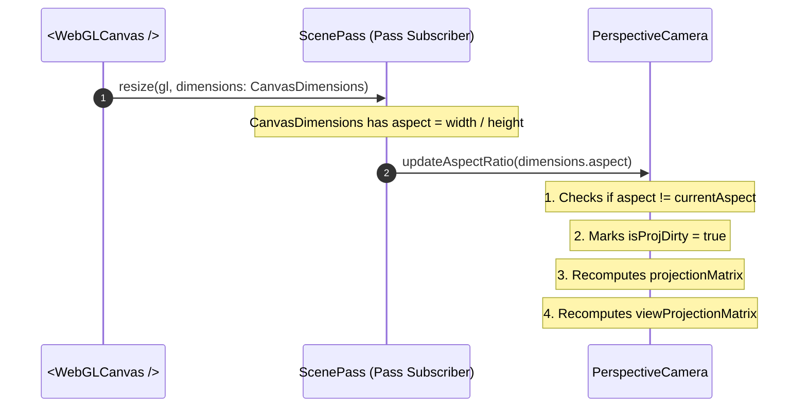

# Camera & View-Projection System Design

## 1. Overview & Design Goals

### Purpose
This document specifies the architectural design for the Camera and View-Projection subsystem. It establishes how 3D scenes are observed, projected, and synchronized with the WebGL rendering canvas.

### Key Architectural Principles
- **Citizen of the Scene Graph:** `Camera` extends `SceneNode`. This grants cameras first-class scene graph citizenship: cameras possess position, rotation (Euler and Quaternion), scale, and can be parented directly to moving objects (e.g. cockpits, pivot nodes, orbits) without custom tracking logic.
- **View Matrix Inversion:** The View Matrix ($V$) is the mathematical inverse of the camera node's world transform matrix ($V = M_{\text{camera, world}}^{-1}$).
- **Transparent & Automated Aspect Ratio Handling:** Developers should not have to manually calculate, pass, or synchronize viewport aspect ratios. The rendering framework (`ScenePass` / canvas subscriber) automatically detects canvas resize events and updates the active camera's aspect ratio transparently.
- **Shared Camera Abstraction:** Both `PerspectiveCamera` (standard 3D perspective with foreshortening) and `OrthographicCamera` (parallel 2D/isometric projection) implement a unified `ICamera` contract.
- **CPU Pre-Multiplied View-Projection Matrix ($VP$):** The camera pre-multiplies $P \times V$ on the CPU whenever the view or projection matrices are marked dirty, saving one $4 \times 4$ matrix multiplication per vertex on the GPU.
- **Deferred Animation & Controllers:** Dynamic camera movement, spline paths, orbit controllers, and tour mechanics are decoupled into a dedicated animation/controller phase so the core camera system remains lean and focused.

---

## 2. Coordinate Conventions & Mathematical Foundations

### View Space Definition
In our right-handed coordinate system:
- In **World Space**, an unrotated camera sits at $(0, 0, 0)$ looking toward $-Z$, with $+Y$ pointing up and $+X$ pointing right.
- In **View Space** (Eye Space), the camera is placed at the origin $(0, 0, 0)$. All world geometry is transformed such that the camera looks directly down the $-Z$ axis.

### View Matrix Derivation ($V$)
If the camera node has a world transformation matrix $M_{\text{camera, world}}$ formed by translation $T(\mathbf{p})$ and rotation $R(\mathbf{q})$:

$$M_{\text{camera, world}} = T(\mathbf{p}) \cdot R(\mathbf{q})$$

The View Matrix $V$ transforms points from world space into view space:

$$V = (M_{\text{camera, world}})^{-1} = (T(\mathbf{p}) \cdot R(\mathbf{q}))^{-1} = R(\mathbf{q})^{-1} \cdot T(\mathbf{p})^{-1}$$

Since the camera's rotation matrix is orthogonal, its inverse is its transpose:

$$R^{-1} = R^T$$

And the inverted translation simply negates the position vector:

$$T(\mathbf{p})^{-1} = T(-\mathbf{p})$$

Therefore:

$$V = R^T \cdot T(-\mathbf{p})$$

### Look-At Target Orientation Formula
The `lookAt(target, up)` method computes the rotation needed for the camera to point from its current position $\mathbf{eye}$ toward a target position $\mathbf{target}$:

1. **Forward Vector ($\mathbf{f}$):** Normalized direction from $\mathbf{eye}$ to $\mathbf{target}$. Since the camera looks down $-Z$:
   $$\mathbf{z}_{\text{axis}} = \text{normalize}(\mathbf{eye} - \mathbf{target})$$
2. **Right Vector ($\mathbf{r}$):** Perpendicular to world up $\mathbf{up}$ and forward:
   $$\mathbf{x}_{\text{axis}} = \text{normalize}(\mathbf{up} \times \mathbf{z}_{\text{axis}})$$
3. **True Up Vector ($\mathbf{u}$):** Perpendicular to $\mathbf{z}_{\text{axis}}$ and $\mathbf{x}_{\text{axis}}$:
   $$\mathbf{y}_{\text{axis}} = \mathbf{z}_{\text{axis}} \times \mathbf{x}_{\text{axis}}$$
4. **Orientation Extraction:** The resulting orthogonal basis $[\mathbf{x}_{\text{axis}}, \mathbf{y}_{\text{axis}}, \mathbf{z}_{\text{axis}}]$ is converted directly into a quaternion and written to the camera's `transform.setRotationQuaternion()`.

### Perspective Projection Matrix ($P_{\text{persp}}$)
Given vertical field of view $\theta_{\text{fov}}$ (in radians), aspect ratio $a = \frac{\text{width}}{\text{height}}$, near plane $n$, and far plane $f$:

$$h = \frac{1}{\tan(\theta_{\text{fov}} / 2)}$$

$$P_{\text{persp}} = \begin{bmatrix}
\frac{h}{a} & 0 & 0 & 0 \\
0 & h & 0 & 0 \\
0 & 0 & \frac{f + n}{n - f} & \frac{2fn}{n - f} \\
0 & 0 & -1 & 0
\end{bmatrix}$$

### Orthographic Projection Matrix ($P_{\text{ortho}}$)
Given bounding volume $[l, r, b, t, n, f]$ (left, right, bottom, top, near, far):

$$P_{\text{ortho}} = \begin{bmatrix}
\frac{2}{r - l} & 0 & 0 & -\frac{r + l}{r - l} \\
0 & \frac{2}{t - b} & 0 & -\frac{t + b}{t - b} \\
0 & 0 & -\frac{2}{f - n} & -\frac{f + n}{f - n} \\
0 & 0 & 0 & 1
\end{bmatrix}$$

---

## 3. Directory Layout & Module Structure

All camera interfaces and classes reside in `src/scene/camera/`:

- **Camera Type Definitions:**
  - [`src/scene/camera/camera_types.ts`](camera_types.ts): Core interfaces (`ICamera`, `PerspectiveCameraOptions`, `OrthographicCameraOptions`).
- **Base Camera Class:**
  - [`src/scene/camera/camera.ts`](camera.ts): Abstract base class extending `SceneNode` and implementing common matrix caching and inversion.
- **Perspective Implementation:**
  - [`src/scene/camera/perspective_camera.ts`](perspective_camera.ts): Field-of-view and frustum management.
- **Orthographic Implementation:**
  - [`src/scene/camera/orthographic_camera.ts`](orthographic_camera.ts): Parallel projection bounds and zoom management.
- **Automated Viewport Synchronization Helper:**
  - [`src/scene/camera/camera_viewport_sync.ts`](camera_viewport_sync.ts): Utility that binds canvas dimension changes directly to the camera's projection.

---

## 4. API & Type Specifications (`src/scene/camera/camera_types.ts`)

```typescript
import type { ISceneNode } from "../core/scene_node_types";
import type { Vector3Like } from "../../maths/vector_types";

export interface PerspectiveCameraOptions {
    /** Vertical field of view in degrees (default: 60) */
    fov?: number;
    /** Near clipping plane distance (default: 0.1) */
    near?: number;
    /** Far clipping plane distance (default: 1000.0) */
    far?: number;
}

export interface OrthographicCameraOptions {
    /** Left frustum plane */
    left?: number;
    /** Right frustum plane */
    right?: number;
    /** Top frustum plane */
    top?: number;
    /** Bottom frustum plane */
    bottom?: number;
    /** Near clipping plane distance (default: 0.1) */
    near?: number;
    /** Far clipping plane distance (default: 1000.0) */
    far?: number;
    /** Zoom factor (default: 1.0) */
    zoom?: number;
}

export interface ICamera extends ISceneNode {
    /** Inverted camera world matrix (transforms world space to view space) */
    readonly viewMatrix: Float32Array;
    
    /** Projection matrix (transforms view space to clip space) */
    readonly projectionMatrix: Float32Array;
    
    /** Pre-multiplied Projection * View matrix */
    readonly viewProjectionMatrix: Float32Array;
    
    /** Near clipping distance */
    near: number;
    
    /** Far clipping distance */
    far: number;
    
    /** Points the camera toward target coordinates in world space */
    lookAt(target: Vector3Like, worldUp?: Vector3Like): this;
    
    /** Internal/framework hook to update aspect ratio automatically */
    updateAspectRatio(aspect: number): void;
    
    /** Forces recalculation of view and projection matrices */
    updateMatrices(): void;
}
```

---

## 5. Automated Aspect Ratio & Canvas Synchronization

### Zero-Configuration Principle
Developers should not have to manually calculate `canvas.width / canvas.height` or wire up window resize event listeners.



### Automatic Hook Lifecycle
1. The canvas component emits dimensions (`CanvasDimensions`) on initial mount and on every browser/layout resize.
2. The `<ScenePass scene={scene} camera={camera} />` receives `resize(gl, dims)`.
3. `ScenePass` calls `camera.updateAspectRatio(dims.aspect)`.
4. If `camera` is a `PerspectiveCamera`, it re-computes its projection matrix with the new aspect ratio.
5. If `camera` is an `OrthographicCamera`, it updates its aspect ratio to prevent non-square distortion.
6. Developer code simply instantiates `const camera = new PerspectiveCamera({ fov: 60 })` and leaves aspect management to the framework.

---

## 6. Matrix Invalidation & Pre-Multiplication Algorithm

To ensure high performance and minimize driver traffic, the camera manages three dirty states:

- `isViewDirty`: Becomes true when the camera's `transform` or parent transforms change (`isWorldDirty` in `SceneNode`).
- `isProjDirty`: Becomes true when `fov`, `near`, `far`, or `aspect` is modified.
- `isViewProjDirty`: Becomes true when either `isViewDirty` or `isProjDirty` is true.

### Frame Evaluation Procedure
When the scene rendering pipeline begins:

1. **Evaluate View Matrix:**
   - If `isViewDirty` is true:
     - Run `updateWorldTransform()` to ensure `camera.worldMatrix` is up to date.
     - Invert `camera.worldMatrix` into `camera.viewMatrix`:
       $$\mathbf{V} = (M_{\text{camera, world}})^{-1}$$
     - Reset `isViewDirty = false`.
     - Flag `isViewProjDirty = true`.

2. **Evaluate Projection Matrix:**
   - If `isProjDirty` is true:
     - Recalculate `camera.projectionMatrix` using `mat4Perspective` or `mat4Ortho`.
     - Reset `isProjDirty = false`.
     - Flag `isViewProjDirty = true`.

3. **Pre-Multiply View-Projection ($VP$):**
   - If `isViewProjDirty` is true:
     - Multiply $\mathbf{VP} = \mathbf{P} \cdot \mathbf{V}$ using `mat4Multiply`.
     - Reset `isViewProjDirty = false`.

4. **Upload to Shaders:**
   - `SceneRenderer` uploads `camera.viewProjectionMatrix` as `u_viewProjectionMatrix` once per frame for all objects sharing that camera.

---

## 7. Decoupled Camera Animation & Controllers (Tabled for Dedicated Phase)

Camera motion patterns (such as orbiting an object, tracking a target, or a scripted fly-through tour) are kept separate from this core camera design:
- Core `Camera` is purely a spatial viewport and projection provider.
- In a subsequent animation design step, an `ICameraController` contract (`update(dt: number): void`) will specify:
  - **`OrbitController`:** Uses spherical coordinates (azimuth, elevation, distance) to orbit a target point.
  - **`TourPathController`:** Follows a list of waypoint vectors and orientation quaternions using Catmull-Rom or linear interpolation with quaternion `slerp`.
  - **`FollowTargetController`:** Smoothly tracks a target `SceneNode` with configurable damping.
