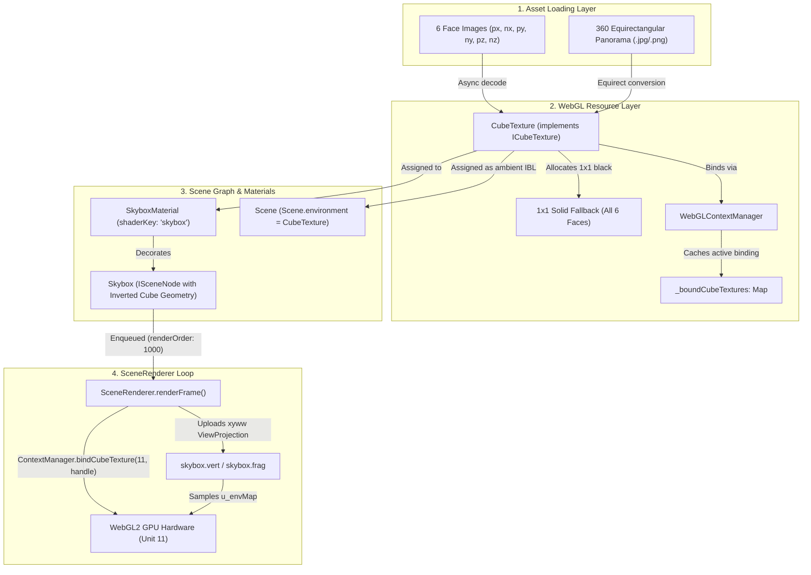

# Cubemap & Skybox Subsystem Architecture Design

## 1. Overview & Architectural Goals

A **Cubemap** (`gl.TEXTURE_CUBE_MAP`) is a specialized WebGL 2 texture target composed of six square 2D texture images mapped to the faces of an omnidirectional bounding cube. In real-time 3D graphics, cubemaps serve two fundamental roles:
- **Skybox / Background:** Providing an immersive, infinite-distance background representing the deep cosmos, sky, or ambient atmospheric environment.
- **Image-Based Lighting (IBL) & Reflection:** Providing directional environment samples for calculating specular reflections, Fresnel edge glints, and ambient radiance on 3D surfaces (PBR chrome, metal, and glass).

This document details the architectural specification for integrating cubemaps and skyboxes into the 3D scene engine, establishing clean abstractions that adhere to our WebGL context caching, async loading lifecycle, and the 16-slot semantic texture registry.

---

### Core Architectural Goals
- **Single-Slot Economy:** Capitalize on the WebGL hardware architecture where all six faces of a cubemap are packaged into a single texture object and bound to a single hardware texture unit (`TextureUnit.Environment = 11`), leaving all other 15 units available for multi-layer diffuse, normal, roughness, and shadow maps.
- **Zero-Stall Fallback:** Provide an immediate 1x1 solid color fallback across all six faces upon instantiation, ensuring shaders compile, link, and render without WebGL errors or pipeline stalls while image assets decode asynchronously in the background.
- **Zero-Overdraw Skybox Rendering ($xyww$ Depth Clamp):** Render skyboxes using the industry-standard $xyww$ clip-space projection trick with `gl.depthFunc(gl.LEQUAL)` and `depthWrite = false`, ensuring the skybox is drawn at maximum depth ($Z = 1.0$) only on pixels where no foreground scene objects were rendered.
- **Automated Context Loss & Restoration:** Maintain image references to gracefully re-allocate GPU texture handles, re-upload fallback data, and asynchronously re-decode/upload face images upon context restoration.
- **Equirectangular & Multi-Face Asset Support:** Support both traditional 6-face cubemap textures and 360-degree equirectangular panoramas.

---

## 2. WebGL 2 Cubemap Mechanics & Coordinates

Unlike standard 2D textures sampled via UV coordinates $(u, v) \in [0, 1]^2$, a cubemap is sampled in GLSL using an unnormalized or normalized **3D direction vector** $\mathbf{v} = (x, y, z) \in \mathbb{R}^3$ originating from the camera or surface reflection point:

```glsl
uniform samplerCube u_envMap;
out vec4 fragColor;

void main() {
    vec3 dir = normalize(v_direction);
    fragColor = texture(u_envMap, dir);
}
```

The GPU hardware texture unit evaluates the direction vector $\mathbf{v}$ in silicon by:
1. Finding the coordinate with the largest absolute magnitude ($\max(|x|, |y|, |z|)$).
2. Selecting the corresponding face target:
   - `+X` (`gl.TEXTURE_CUBE_MAP_POSITIVE_X`): Right
   - `-X` (`gl.TEXTURE_CUBE_MAP_NEGATIVE_X`): Left
   - `+Y` (`gl.TEXTURE_CUBE_MAP_POSITIVE_Y`): Top (Zenith)
   - `-Y` (`gl.TEXTURE_CUBE_MAP_NEGATIVE_Y`): Bottom (Nadir)
   - `+Z` (`gl.TEXTURE_CUBE_MAP_POSITIVE_Z`): Front
   - `-Z` (`gl.TEXTURE_CUBE_MAP_NEGATIVE_Z`): Back
3. Dividing the remaining two coordinates by the major coordinate to form the $(u, v)$ coordinates for sampling that face.
4. Performing seamless hardware bilinear filtering across the seams between adjacent cube faces.

---

## 3. Subsystem Architecture & Data Flow

The cubemap architecture bridges the low-level WebGL context manager, material domain, scene graph, and pass renderer:



---

## 4. Types & Interfaces Specification

All contracts reside in dedicated type definition files separate from concrete implementations.

### Cubemap Faces & Construction Options (`src/webgl/cube_texture_types.ts`)

```typescript
import type { TextureFilter, TextureFormat, TextureWrap } from "./texture_types";

/**
 * 6-face mapping for a cubic environment map.
 */
export interface CubeTextureFaces<T = string | HTMLImageElement | ImageBitmap> {
    /** Positive X face (Right) */
    px: T;
    /** Negative X face (Left) */
    nx: T;
    /** Positive Y face (Top / Zenith) */
    py: T;
    /** Negative Y face (Bottom / Nadir) */
    ny: T;
    /** Positive Z face (Front) */
    pz: T;
    /** Negative Z face (Back) */
    nz: T;
}

/**
 * Configuration options for constructing a CubeTexture.
 */
export interface CubeTextureOptions {
    /** Minification filter (defaults to "linear_mipmap_linear") */
    minFilter?: TextureFilter;
    /** Magnification filter (defaults to "linear") */
    magFilter?: TextureFilter;
    /** Texture wrapping mode (defaults to "clamp_to_edge") */
    wrapS?: TextureWrap;
    /** Texture wrapping mode (defaults to "clamp_to_edge") */
    wrapT?: TextureWrap;
    /** Pixel data format (defaults to "rgba") */
    format?: TextureFormat;
    /** Whether to generate mipmaps when dimensions allow (defaults to true) */
    generateMipmaps?: boolean;
    /** Fallback RGBA color used for initial 1x1 faces before decode (defaults to [0, 0, 0, 255]) */
    fallbackColor?: [number, number, number, number];
    /** Human-readable debug label */
    label?: string;
}

/**
 * Public contract for managed WebGL cubemap resources.
 */
export interface ICubeTexture {
    /** Unique debug label */
    readonly label: string;
    /** Underlying WebGLTexture handle (null if context lost) */
    readonly handle: WebGLTexture | null;
    /** Pixel dimension of square faces (1 before decode completes) */
    readonly size: number;
    /** Whether all 6 face images have finished decoding and uploading */
    readonly isLoaded: boolean;
    /** Active configuration options */
    readonly options: Readonly<CubeTextureOptions>;

    /** Binds cubemap to a hardware texture unit via WebGLContextManager */
    bind(unit?: number): void;
    /** Releases GPU memory */
    destroy(): void;
    /** WebGL context lost lifecycle hook */
    onContextLost(): void;
    /** WebGL context restored lifecycle hook */
    onContextRestored(gl: WebGL2RenderingContext): void;
}
```

### Skybox Material & Scene Node Contracts (`src/scene/environment/skybox_types.ts`)

```typescript
import type { IMaterial } from "../materials/material_types";
import type { ISceneNode } from "../core/scene_node_types";
import type { ICubeTexture } from "../../webgl/cube_texture_types";

/**
 * Construction options for SkyboxMaterial.
 */
export interface SkyboxMaterialOptions {
    /** Cubemap texture resource */
    envMap: ICubeTexture;
    /** Tint color multiplier [R, G, B, A] (defaults to [1, 1, 1, 1]) */
    tint?: [number, number, number, number];
    /** Exposure / brightness multiplier (defaults to 1.0) */
    exposure?: number;
    /** Optional Y-axis rotation in radians (defaults to 0) */
    rotationY?: number;
}

/**
 * Public contract for Skybox scene nodes.
 */
export interface ISkybox extends ISceneNode {
    /** Active environment cubemap */
    cubeTexture: ICubeTexture;
    /** Tint color multiplier */
    tint: [number, number, number, number];
    /** Exposure multiplier */
    exposure: number;
    /** Y-axis rotation in radians */
    rotationY: number;
}
```

---

## 5. Subsystem Procedures & Algorithms

### 1. Zero-Stall 1x1 Face Allocation & Async Decoding
To guarantee the rendering pipeline never blocks or fails when a skybox is added:
- **Phase A (Synchronous Allocation):**
  1. Instantiates `gl.createTexture()`.
  2. Binds target to `gl.TEXTURE_CUBE_MAP`.
  3. Uploads a 1x1 pixel buffer (`options.fallbackColor ?? [0, 0, 0, 255]`) to each of the six targets:
     - `gl.TEXTURE_CUBE_MAP_POSITIVE_X`
     - `gl.TEXTURE_CUBE_MAP_NEGATIVE_X`
     - `gl.TEXTURE_CUBE_MAP_POSITIVE_Y`
     - `gl.TEXTURE_CUBE_MAP_NEGATIVE_Y`
     - `gl.TEXTURE_CUBE_MAP_POSITIVE_Z`
     - `gl.TEXTURE_CUBE_MAP_NEGATIVE_Z`
  4. Configures `gl.TEXTURE_MIN_FILTER` to `gl.LINEAR` and wrapping to `gl.CLAMP_TO_EDGE`.
  5. Sets `this._isLoaded = false` and `this._size = 1`.
- **Phase B (Asynchronous Decoding & Upload):**
  1. Spawns six `new Image()` instances for `[px, nx, py, ny, pz, nz]`.
  2. Sets `crossOrigin = "anonymous"`.
  3. Awaits `Promise.all([img0.decode(), ..., img5.decode()])`.
  4. Once all six decode successfully, binds `gl.TEXTURE_CUBE_MAP`.
  5. Sets `gl.pixelStorei(gl.UNPACK_FLIP_Y_WEBGL, false)` (cubemap faces must NOT be flipped on Y per the OpenGL cubemap coordinate specification).
  6. Uploads each face using `gl.texImage2D(target, 0, format, format, gl.UNSIGNED_BYTE, image)`.
  7. Calls `gl.generateMipmap(gl.TEXTURE_CUBE_MAP)` if mipmapping is enabled.
  8. Updates `this._size = images[0].width` and `this._isLoaded = true`.

### 2. Context Manager Cubemap State Deduplication (`src/webgl/context_manager.ts`)
To prevent redundant driver calls across meshes that sample the environment:
- **State Map:** Maintains `_boundCubeTextures: Map<number, WebGLTexture | null>` tracking the active cubemap bound per texture unit.
- **`bindCubeTexture(unit: number, texture: WebGLTexture | null)`:**
  1. Checks if `_boundCubeTextures.get(unit) === texture`. If true, returns immediately.
  2. Activates unit: `if (_activeTextureUnit !== unit) gl.activeTexture(gl.TEXTURE0 + unit)`.
  3. Binds texture: `gl.bindTexture(gl.TEXTURE_CUBE_MAP, texture)`.
  4. Records cache: `_boundCubeTextures.set(unit, texture)`.
- **Default 1x1 Black Cubemap Singleton:**
  - `getDefaultBlackCubeTexture()` returns a singleton 1x1 black cubemap allocated during context initialization.
  - Used as fallback if a material declares `u_envMap` before a `CubeTexture` finishes loading.

### 3. The Zero-Overdraw $xyww$ Skybox Projection Technique
Skyboxes can be rendered at the end of the opaque pass to completely eliminate overdraw.

#### The Depth Clamp Mathematics
In clip space, the GPU calculates depth as:
$$z_{\text{ndc}} = \frac{z_{\text{clip}}}{w_{\text{clip}}}$$

By projecting the vertex with a modified vector:
```glsl
// skybox.vert
#version 300 es
layout(location = 0) in vec3 a_position;

uniform mat4 u_viewProjectionMatrix;
uniform float u_rotationY;

out vec3 v_direction;

void main() {
    v_direction = a_position;
    
    // Apply optional skybox rotation
    float c = cos(u_rotationY);
    float s = sin(u_rotationY);
    mat3 rot = mat3(
        c, 0.0, s,
        0.0, 1.0, 0.0,
        -s, 0.0, c
    );
    vec3 rotatedPos = rot * a_position;

    // View-projection with position scaled to clip space
    vec4 clipPos = u_viewProjectionMatrix * vec4(rotatedPos, 0.0);

    // Replace z with w so that z / w = 1.0 (maximum depth)
    gl_Position = clipPos.xyww;
}
```

#### Pipeline Configuration for Skybox
- **Depth Test:** `gl.enable(gl.DEPTH_TEST)`
- **Depth Function:** `gl.depthFunc(gl.LEQUAL)` (Allows pixels with depth equal to 1.0 to pass where the clear depth was set to 1.0)
- **Depth Write Mask:** `gl.depthMask(false)` (The skybox never writes to depth)
- **Culling:** `gl.disable(gl.CULL_FACE)` or front-face culling since camera is inside the cube.
- **Render Order:** `renderOrder: 1000` (Rendered after all opaque geometry).

### 4. Skybox Fragment Shader (`src/scene/shaders/skybox.frag`)
```glsl
#version 300 es
precision highp float;

in vec3 v_direction;

uniform samplerCube u_envMap;
uniform vec4 u_tint;
uniform float u_exposure;

out vec4 fragColor;

void main() {
    vec4 texColor = texture(u_envMap, v_direction);
    fragColor = texColor * u_tint * u_exposure;
}
```

---

## 6. Key Architectural Decisions & Trade-offs

### 1. Cubemap Single-Slot Binding vs Multi-Slot
- **Decision:** A cubemap occupies exactly **1 texture unit** (`TextureUnit.Environment = 11`), not 6.
- **Rationale:** WebGL specification treats `gl.TEXTURE_CUBE_MAP` as a single multi-face texture object. Binding `gl.TEXTURE_CUBE_MAP` to unit 11 makes all six faces accessible to `samplerCube u_envMap` simultaneously.

### 2. $xyww$ Skybox vs Inverted Huge Cube
- **Decision:** Use the $xyww$ clip-space depth trick rather than scaling a huge cube geometry (e.g. $1000 \times 1000 \times 1000$).
- **Rationale:**
  - A huge cube suffers from far-plane clipping artifacts if the camera moves or has a low `far` distance.
  - The $xyww$ trick projects the skybox mathematically onto the far plane ($z = 1.0$) regardless of camera clip distances.
  - Setting `renderOrder: 1000` means the skybox is only drawn on unrendered background pixels, saving massive GPU fill-rate.

### 3. Equirectangular Panoramas vs 6-Face Cubemaps
- **Decision:** Support both formats:
  - 6-face cubemaps for production performance and native GPU hardware filtering.
  - Single equirectangular 360-degree panorama images with a utility converter / procedural sampler pass.
- **Rationale:** Equirectangular panoramas are easier to author and download as a single file, while cubemaps eliminate spherical distortion at poles and sample faster.

---

## 7. Implementation Roadmap

- **Phase 1: Contracts & Types (`src/webgl/cube_texture_types.ts`)**
  - Define `CubeTextureFaces`, `CubeTextureOptions`, and `ICubeTexture`.
- **Phase 2: Context Manager Cubemap Support (`src/webgl/context_manager.ts`)**
  - Add `bindCubeTexture(unit, handle)` with redundant call deduplication.
  - Add default 1x1 black cubemap fallback singleton.
- **Phase 3: CubeTexture Resource Class (`src/webgl/cube_texture.ts`)**
  - Implement 6-face asynchronous image loading and 1x1 solid fallback.
  - Implement automated context loss and recovery lifecycle.
- **Phase 4: Skybox Shaders & Material (`src/scene/environment/`)**
  - Create `skybox.vert` (using $xyww$ depth projection) and `skybox.frag`.
  - Create `SkyboxMaterial` extending `Material` with `shaderKey: "skybox"`.
- **Phase 5: Skybox Scene Node & Pass Integration (`src/scene/environment/skybox.ts`)**
  - Create `Skybox` class inheriting `ModelInstance` using inverted `CubeGeometry`.
  - Verify with `npm run build`.
