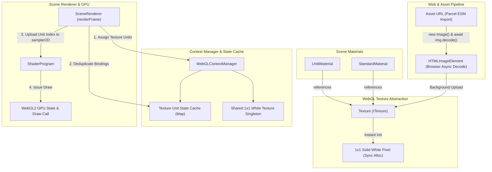

# Texture & Material System Architecture Design

## 1. Executive Summary & Design Goals

### Overview
This design document defines the architectural specification for 2D texture resources, hardware texture unit state management, and `sampler2D` shader uniform bindings within the 3D scene engine. It establishes how textures are sourced, asynchronously fetched and decoded on the web, cached across draw calls, and bound to materials.

### Core Challenges on the Web
- **Asynchronous Asset Pipeline:** Unlike desktop runtimes where image files can be loaded synchronously from disk, web browsers download assets asynchronously over HTTP and decode compressed images (`.png`, `.jpg`, `.webp`, `.avif`) on browser threads.
- **Zero-Stall Rendering (1x1 Fallback Pattern):** Rendering cannot be blocked while waiting for network requests. Shaders expecting `sampler2D` must sample valid GPU textures immediately on frame 1 without throwing errors or causing blank flashes.
- **Texture Unit State Caching:** WebGL uses a limited bank of hardware texture units (`gl.TEXTURE0` through `gl.TEXTURE31`). Redundant state switches (`gl.activeTexture()` and `gl.bindTexture()`) during per-frame mesh traversal must be cached and eliminated.
- **Coordinate Space Discrepancy:** DOM and browser image elements position their origin $(0, 0)$ at the top-left, whereas OpenGL texture coordinates $UV(0, 0)$ reside at the bottom-left.
- **WebGL Context Recovery:** When a WebGL context is lost (GPU hang, tab backgrounding) and subsequently restored, all GPU texture handles are invalidated and must be reconstructed and re-uploaded seamlessly without re-downloading network assets.

---

## 2. Web Browser Texture Lifecycle & Mechanics

### Asynchronous Loading & Decoding Pipeline
- **Asset Import:** Assets are imported via Parcel's relative ESM imports (e.g. `import heroTexture from "./textures/hero.png"`), yielding a cache-busted URL string.
- **Image Instantiation:** An `HTMLImageElement` is created in memory via `new Image()`.
- **Asynchronous Decode:** The modern browser API `await img.decode()` decodes the compressed image data asynchronously without blocking the UI thread or animation loop.

### The 1x1 Fallback Pattern
To guarantee uninterrupted rendering and eliminate pop-in glitches:
- **Synchronous Initialization:** Upon constructing a `Texture` instance, a synchronous 1-pixel GPU texture (solid white `[255, 255, 255, 255]`) is immediately uploaded to mip level 0 using `gl.texImage2D()`.
- **Immediate Material Binding:** Any material referencing the texture can immediately issue draw calls using the 1x1 fallback pixel as a neutral tint multiplier.
- **Seamless GPU Upload:** When the underlying `HTMLImageElement` completes downloading and decoding, the engine uploads the full image via `gl.texImage2D()` / `gl.texSubImage2D()`, configures filtering, generates mipmaps if appropriate, and marks the texture as loaded.

### Texture Parameters & Formatting
- **Coordinate Flipping:** `gl.pixelStorei(gl.UNPACK_FLIP_Y_WEBGL, true)` is enabled prior to image upload to match GL $UV$ coordinate conventions.
- **Wrapping Modes:**
  - `gl.CLAMP_TO_EDGE` (default for non-repeating UI or clamp assets)
  - `gl.REPEAT` (for tiling surfaces, requiring power-of-two dimensions or WebGL2 support)
  - `gl.MIRRORED_REPEAT`
- **Filtering Modes:**
  - Magnification: `gl.LINEAR` or `gl.NEAREST`
  - Minification: `gl.LINEAR_MIPMAP_LINEAR` (trilinear filtering with full mip chain), `gl.LINEAR`, or `gl.NEAREST`
- **Mipmap Generation:** Generated via `gl.generateMipmap(gl.TEXTURE_2D)` when enabled.

### Texture Units & Sampler Binding
WebGL decouples texture memory from shader execution via numbered texture units:
- **Activation:** The renderer designates an active unit via `gl.activeTexture(gl.TEXTURE0 + unitIndex)`.
- **Binding:** The GPU texture handle is bound to the target unit via `gl.bindTexture(gl.TEXTURE_2D, textureHandle)`.
- **Shader Sampler Association:** The shader's `sampler2D` uniform location is assigned the integer unit index via `gl.uniform1i(samplerLocation, unitIndex)`.
- **GLSL Sampling:** The fragment shader samples color texels using `texture(u_texture, v_uv)`.

---

## 3. System Architecture & Component Diagram



---

## 4. Types & Interfaces Specification

All contracts and interfaces reside in `src/webgl/texture_types.ts`, separate from runtime implementations.

### Filtering and Wrapping Types
```typescript
/**
 * WebGL texture magnification and minification filter presets.
 */
export type TextureFilter = 
    | "nearest"
    | "linear"
    | "nearest_mipmap_nearest"
    | "linear_mipmap_nearest"
    | "nearest_mipmap_linear"
    | "linear_mipmap_linear";

/**
 * WebGL texture wrapping modes for S and T coordinates.
 */
export type TextureWrap = "clamp_to_edge" | "repeat" | "mirrored_repeat";

/**
 * Pixel data formats supported for texture allocation.
 */
export type TextureFormat = "rgba" | "rgb" | "alpha" | "luminance";
```

### Configuration Options
```typescript
/**
 * Configuration options for constructing or updating a Texture.
 */
export interface TextureOptions {
    /** Horizontal wrap mode (defaults to "clamp_to_edge") */
    wrapS?: TextureWrap;
    /** Vertical wrap mode (defaults to "clamp_to_edge") */
    wrapT?: TextureWrap;
    /** Minification filter (defaults to "linear_mipmap_linear") */
    minFilter?: TextureFilter;
    /** Magnification filter (defaults to "linear") */
    magFilter?: TextureFilter;
    /** Whether to flip the Y axis to match WebGL UV coordinates (defaults to true) */
    flipY?: boolean;
    /** Whether to generate mipmaps when dimensions allow (defaults to true) */
    generateMipmaps?: boolean;
    /** Human-readable label for debugging and context logging */
    label?: string;
}
```

### Public Texture Contract (`ITexture`)
```typescript
/**
 * Public contract for managed WebGL texture resources.
 */
export interface ITexture {
    /** Unique debug label */
    readonly label: string;
    /** Underlying WebGLTexture GPU handle (null if context lost) */
    readonly handle: WebGLTexture | null;
    /** Width in pixels (1 before image decode completes) */
    readonly width: number;
    /** Height in pixels (1 before image decode completes) */
    readonly height: number;
    /** Whether the full source asset has finished loading and uploading */
    readonly isLoaded: boolean;
    /** Active configuration options */
    readonly options: Readonly<TextureOptions>;

    /** Binds texture to a specific hardware texture unit */
    bind(unit?: number): void;
    /** Releases GPU texture memory */
    destroy(): void;
    /** WebGL context lost lifecycle hook */
    onContextLost(): void;
    /** WebGL context restored lifecycle hook */
    onContextRestored(gl: WebGL2RenderingContext): void;
}
```

---

## 5. Subsystem Design & Component Procedures

### 1. WebGL Texture Resource Wrapper (`src/webgl/texture.ts`)
- **Constructor:**
  - Receives `IWebGLContextManager` and optional `TextureOptions`.
  - Immediately allocates a `WebGLTexture` and uploads a 1x1 RGBA pixel buffer `[255, 255, 255, 255]`.
  - Sets `isLoaded = false`, `width = 1`, `height = 1`.
- **Asynchronous Asset Load Procedure (`loadFromUrl`):**
  1. Instantiates `new Image()`.
  2. Sets `image.crossOrigin = "anonymous"`.
  3. Assigns `image.src = url`.
  4. Awaits `image.decode()`.
  5. Binds texture and sets `gl.pixelStorei(gl.UNPACK_FLIP_Y_WEBGL, options.flipY ?? true)`.
  6. Uploads image via `gl.texImage2D(gl.TEXTURE_2D, 0, gl.RGBA, gl.RGBA, gl.UNSIGNED_BYTE, image)`.
  7. Configures wrap parameters (`wrapS`, `wrapT`) and filter parameters (`minFilter`, `magFilter`).
  8. Calls `gl.generateMipmap(gl.TEXTURE_2D)` if `generateMipmaps` is true.
  9. Updates `this._width = image.width`, `this._height = image.height`, and `this._isLoaded = true`.
  10. Triggers any registered `onUpdate` listeners so scene renderers know new texture data is ready.
- **Context Recovery Procedure:**
  - Maintains the source URL or image reference.
  - On `onContextRestored(gl)`: recreates the GPU handle, re-uploads the 1x1 fallback, and asynchronously re-uploads the source image.

### 2. Context Manager Texture State Caching (`src/webgl/context_manager.ts`)
To prevent redundant driver overhead:
- **State Map:** `_boundTextures: Map<number, WebGLTexture | null>` tracks which texture handle is currently bound to each texture unit index ($0 \to 31$).
- **`bindTexture(unit: number, texture: WebGLTexture | null)`:**
  1. If `_boundTextures.get(unit) === texture`, immediately return (redundant call skipped).
  2. If the current active texture unit differs from `unit`, call `gl.activeTexture(gl.TEXTURE0 + unit)` and update cached active unit.
  3. Call `gl.bindTexture(gl.TEXTURE_2D, texture)`.
  4. Cache `_boundTextures.set(unit, texture)`.
- **Default 1x1 White Texture Singleton:**
  - Maintains `_defaultWhiteTexture: WebGLTexture | null`.
  - Initialized during context creation and restored during context recovery.
  - Provides a shared fallback for any unbound or untextured material slots without allocating duplicate GPU memory.

### 3. `ShaderProgram` Sampler Binding (`src/webgl/shader_program.ts`)
- **`setTexture(uniformName: string, unitIndex: number, texture: ITexture | WebGLTexture)`:**
  - Resolves GPU texture handle.
  - Delegates to `contextManager.bindTexture(unitIndex, handle)`.
  - Sets uniform integer: `this.setInt(uniformName, unitIndex)`.
- **Dynamic Uniform Dictionary Integration:**
  - When `setUniforms()` encounters an `ITexture` instance in the uniform map, it automatically assigns it to an available texture unit, binds it, and sets the corresponding integer uniform.

### 4. Material Integration (`src/scene/materials/`)
- **`MaterialOptions` Extension:**
  - Adds optional `textures?: Record<string, ITexture | string>` mapping uniform sampler names to texture instances or URLs.
- **`UnlitMaterial` Updates:**
  - Constructor accepts `texture?: ITexture | string`.
  - If provided, sets `u_useTexture = 1.0` and maps `u_texture` to unit `0`.
  - Exposes `public setTexture(texture: ITexture | string | null): this`.
- **`StandardMaterial` Updates:**
  - Standardizes `map` (albedo/color texture) and future normal/roughness map slots.

### 5. `SceneRenderer` Pass Execution (`src/scene/renderer/scene_renderer.ts`)
- **Pre-Draw Texture Synchronization:**
  - During the instance render loop:
    1. Apply pipeline state (`depthTest`, `blendMode`, `cullFace`).
    2. Activate shader program.
    3. Upload Tier A (camera) and Tier B (model transform) uniforms.
    4. Bind and configure material textures.
    5. Upload Tier C (material domain) uniforms.
    6. Bind VAO and dispatch `gl.drawElements` / `gl.drawArrays`.

## 6. Key Architectural Decisions

### Unified Material with Polymorphic `.clone()` (Approach A)
- **Rationale:** Rather than introducing a distinct `MaterialInstance` class hierarchy (as in Unreal Engine), the engine adopts the unified material model (similar to Three.js).
- In this engine, `WebGLContextManager` and `ShaderProgram` already act as the shared "Master Material" template (cached once per `ShaderKey`).
- Every `Material` instance independently manages its own uniforms dictionary and conventional texture unit bindings (`Map<number, ITexture>`).
- Polymorphic `.clone()` allows rapid duplication of materials with distinct parameter or texture overrides while avoiding the indirection and per-frame prototype merging costs of a cascaded `MaterialInstance` tree.

### Conventional Semantic Texture Slots
- **Slot Mapping:**
  - **Unit 0:** Base Color / Diffuse Map (`u_texture`)
  - **Unit 1:** Normal Map (`u_normalMap`)
  - **Unit 2:** Roughness / Specular Map (`u_roughnessMap`)
  - **Unit 3:** Emissive / Glow Map (`u_emissiveMap`)
- **Performance Benefits:**
  - Shader sampler uniforms are initialized once with static unit indices (e.g. `u_texture` bound to unit `0`).
  - Eliminates dynamic uniform mutation overhead per draw call.
  - Allows `WebGLContextManager.bindTexture(unit, handle)` to cache hardware unit bindings and skip redundant OpenGL driver calls between meshes sharing textures.

---

## 7. Implementation Roadmap

- **Phase 1: Type Contracts & WebGL Texture Wrapper** (Completed)
  - Create `src/webgl/texture_types.ts`.
  - Implement `src/webgl/texture.ts` with 1x1 fallback and async decode.
- **Phase 2: Context Manager Texture State Caching** (Completed)
  - Update `src/webgl/context_manager_types.ts` and `src/webgl/context_manager.ts`.
  - Add active unit tracking, hardware limits (`MAX_TEXTURE_IMAGE_UNITS`), and default 1x1 white texture singleton.
- **Phase 3: Material Texture Support & Polymorphic Cloning** (Completed)
  - Implement `setTexture(unit, tex)`, `getTexture(unit)`, `getTextures()`, and `clone()` on `Material` and `UnlitMaterial`.
- **Phase 4: Renderer Texture Binding & Synchronization** (Completed)
  - Update `src/scene/renderer/scene_renderer.ts` to synchronize texture unit bindings in `renderFrame()`.
  - Verified with `npm run build`.
