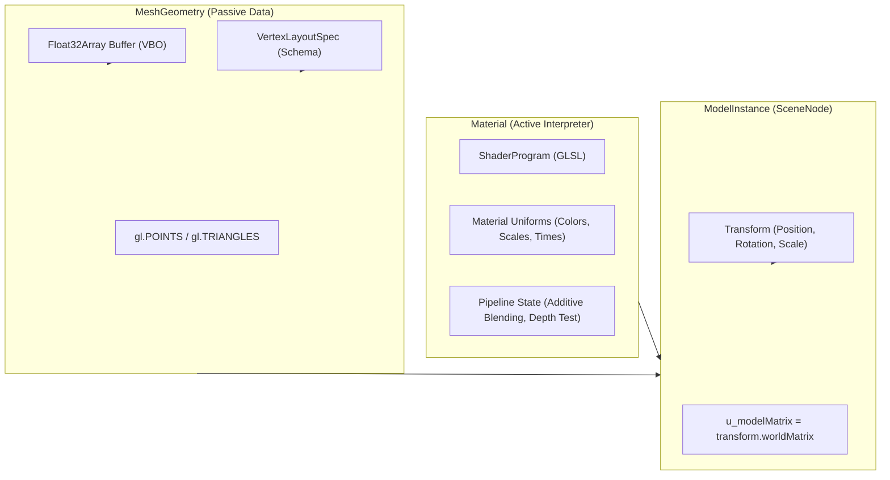

# Model Space, Geometry & Material Architecture Design

## 1. Overview & Design Goals

### Purpose
This document specifies the architectural design for 3D Geometry, Materials, and Model Instances. It defines how vertex data is authored in model space, how visual styling and shaders are encapsulated in materials, and how renderable instances are structured and integrated into the scene graph.

### Key Architectural Principles
- **Pure Model Space Authoring:** All geometries, whether procedural meshes or particle distributions, are authored and generated in local coordinates centered around $(0, 0, 0)$ without hardcoding world positioning, orientation, or camera distances.
- **The Geometry-Material Contract:**
  - **`MeshGeometry` (Passive Storage & Schema):** Encapsulates the raw vertex/index byte buffers, attribute layout schema ([`VertexLayoutSpec`](../../webgl/geometry/vertex_layout_types.ts)), vertex count, and primitive type (`gl.TRIANGLES`, `gl.POINTS`, `gl.LINES`). It contains zero shaders, zero uniforms, and zero rendering logic.
  - **`Material` (Active Shader Interpreter & State Owner):** Encapsulates the visual appearance. It binds the shader program that understands the geometry's attribute layout, supplies material-specific uniform values, and asserts required WebGL pipeline states (blending presets, depth testing, culling).
  - **`ModelInstance` (Scene Citizen):** Extends `SceneNode`, marrying a `MeshGeometry` and a `Material` with a spatial `Transform` in the scene graph.
- **Dual Support: Standard Cartesian Path vs. Procedural GPU-Evaluated Path:**
  - Standard meshes (cubes, spheres, quads) use standard Cartesian $[x, y, z]$ coordinates with normals and UVs.
  - Procedural systems (such as the Galaxy backdrop) use custom domain attributes (e.g. polar coordinates $[r, \theta, z]$ and simulation parameters) where the vertex shader does the heavy lifting of evaluating positions on the fly.
- **Lightweight Demo Focus (No Game Engine Bloat):** Intentionally avoids complex Entity-Component-Systems (ECS), heavy physical material pipelines (PBR), or multi-stage deferred render graphs in favor of a direct, high-performance abstraction optimized for interactive web demos.
- **Zero-Disruption Galaxy Integration:** The existing spiral galaxy simulation maps directly into this architecture without modifying its star math or GLSL shaders.
- **Resource Management via Context Manager:** All GPU buffers (VBO, IBO, VAO) are decoupled from CPU `MeshGeometry` and managed through [`GeometryManager`](../../webgl/geometry/geometry_manager_design.md) on [`WebGLContextManager`](../../webgl/core/context_manager.ts).

---

## 2. The Geometry-Material Contract & Internal Mechanics



### What Actually Happens Inside Geometries

Geometries are passive CPU data generation routines that allocate a contiguous `Float32Array` and define a `VertexLayoutSpec`:

- **Inside `SphereGeometry` (Standard Cartesian Path):**
  - Runs a latitude/longitude subdivision double-loop on the CPU.
  - Calculates Cartesian positions: $(x, y, z) = (r \sin \theta \cos \phi, r \cos \theta, r \sin \theta \sin \phi)$.
  - Calculates surface normals: $(n_x, n_y, n_z) = \text{normalize}(x, y, z)$.
  - Calculates UV coordinates: $(u, v)$.
  - Packs these into a contiguous buffer with `STANDARD_VERTEX_LAYOUT` (`location 0: vec3 a_position`, `location 1: vec3 a_normal`, `location 2: vec2 a_uv`).
  - Sets `primitiveType = gl.TRIANGLES`.
- **Inside `GalaxyGeometry` (Procedural Path):**
  - Executes [`generateStarBuffer(galaxyParams)`](../../galaxy_backdrop/galaxy_math.ts).
  - Loops `starCount` times and populates a contiguous `Float32Array` with 6 scalar floats per star:
    `[radius, baseAngle, zOffset, size, spectralType, driftPhase]`.
  - Pairs the buffer with `GALAXY_VERTEX_LAYOUT` (`location 0: a_radius`, `location 1: a_baseAngle`, ..., `location 5: a_driftPhase`).
  - Sets `primitiveType = gl.POINTS`.
  - **Notice:** `GalaxyGeometry` contains no shaders or galaxy math of its own—it simply holds the star buffer and declares the 6-attribute layout!

### Why the Material Is What Enables the Galaxy

The reason the galaxy renders correctly is that it is paired with a **`GalaxyMaterial`** that cooperates with `GalaxyGeometry`:
- Its vertex shader (`galaxy_pinprick.vert`) expects input locations $0 \to 5$ matching `GALAXY_VERTEX_LAYOUT`.
- It performs the differential spiral rotation and drift inside the vertex shader on the GPU.
- It supplies the galaxy domain uniforms (`u_rotationSpeed`, `u_driftSpeed`, `u_pointScale`, `u_coreColor`, `u_armInnerColor`).
- Its fragment shader evaluates Gaussian point-sprite needle falloff and photometric luminosity.
- It enforces the necessary WebGL pipeline states: `gl.blendFunc(gl.ONE, gl.ONE)` (additive blending) and `gl.disable(gl.DEPTH_TEST)`.

---

## 3. Standard Path vs. Procedural Galaxy Path

### Side-by-Side GLSL Vertex Shader Comparison

- **Standard Cartesian Vertex Shader (`StandardMaterial`):**
  ```glsl
  #version 300 es
  precision highp float;

  layout(location = 0) in vec3 a_position;
  layout(location = 1) in vec3 a_normal;
  layout(location = 2) in vec2 a_uv;

  uniform mat4 u_modelMatrix;
  uniform mat4 u_viewProjectionMatrix;
  uniform mat3 u_normalMatrix;

  out vec3 v_normal;
  out vec2 v_uv;

  void main() {
      v_normal = u_normalMatrix * a_normal;
      v_uv = a_uv;
      vec4 worldPos = u_modelMatrix * vec4(a_position, 1.0);
      gl_Position = u_viewProjectionMatrix * worldPos;
  }
  ```

- **Procedural Galaxy Vertex Shader (`GalaxyMaterial`):**
  ```glsl
  #version 300 es
  precision highp float;

  // 1. Receives custom polar and simulation attributes
  layout(location = 0) in float a_radius;
  layout(location = 1) in float a_baseAngle;
  layout(location = 2) in float a_zOffset;
  layout(location = 3) in float a_size;
  layout(location = 4) in float a_spectralType;
  layout(location = 5) in float a_driftPhase;

  uniform mat4 u_modelMatrix;          // Allows galaxy placement/scale in scene
  uniform mat4 u_viewProjectionMatrix; // Camera VP matrix
  uniform mat4 u_viewMatrix;           // Camera view matrix for distance sizing
  uniform float u_time;
  // ... galaxy-specific uniforms ...

  void main() {
      // 2. Heavy spiral and drift math computed entirely on GPU
      float theta = a_baseAngle + (u_rotationSpeed * u_time) + diffOffset;
      float posX = r * cos(theta);
      float posZ = r * sin(theta);
      float posY = a_zOffset + dz;

      // 3. Synthesize model-space coordinate and apply standard transform pipeline
      vec4 localModelPos = vec4(posX, posY, posZ, 1.0);
      vec4 worldPos = u_modelMatrix * localModelPos;
      gl_Position = u_viewProjectionMatrix * worldPos;

      // 4. View-space distance sizing and fade
      vec4 viewPos = u_viewMatrix * worldPos;
      float dist = max(0.05, -viewPos.z);
      // ... point sizing and fade pass-through ...
  }
  ```

---

## 4. Directory Layout & Module Structure

All geometry, material, and instance classes reside in `src/scene/models/` and `src/scene/materials/`:

- **Geometry Layer (`src/scene/models/`):**
  - [`src/scene/models/mesh_geometry_types.ts`](mesh_geometry_types.ts): Core interfaces (`IMeshGeometry`, `GeometryBufferData`).
  - [`src/scene/models/mesh_geometry.ts`](mesh_geometry.ts): Base geometry class wrapping [`VertexBuffer`](../../webgl/geometry/vertex_buffer.ts) and [`VertexLayoutSpec`](../../webgl/geometry/vertex_layout_types.ts).
  - [`src/scene/models/primitives/cube_geometry.ts`](primitives/cube_geometry.ts): Standard unit cube generator.
  - [`src/scene/models/primitives/sphere_geometry.ts`](primitives/sphere_geometry.ts): Standard unit sphere generator.
  - [`src/scene/models/primitives/quad_geometry.ts`](primitives/quad_geometry.ts): Standard unit quad / billboard generator.
  - [`src/scene/models/specialized/galaxy_geometry.ts`](specialized/galaxy_geometry.ts): Procedural star buffer geometry wrapping `generateStarBuffer()`.
- **Material Layer (`src/scene/materials/`):**
  - [`src/scene/materials/material_types.ts`](../materials/material_types.ts): Core interfaces (`IMaterial`, `MaterialOptions`, `BlendMode`, `PipelineState`).
  - [`src/scene/materials/material.ts`](../materials/material.ts): Base material class managing shader keys, uniforms, and WebGL state assertion.
  - [`src/scene/materials/standard_material.ts`](../materials/standard_material.ts): Default material pairing with Cartesian `StandardGeometry`.
  - [`src/scene/materials/specialized/galaxy_material.ts`](../materials/specialized/galaxy_material.ts): Domain material pairing with `GalaxyGeometry` (pinprick shaders + additive blend state + parameters).
- **Model Instance Layer (`src/scene/models/`):**
  - [`src/scene/models/model_instance_types.ts`](model_instance_types.ts): Contracts for renderable scene graph entities.
  - [`src/scene/models/model_instance.ts`](model_instance.ts): Class extending `SceneNode`, holding `geometry` and `material`.

---

## 5. API & Type Specifications

### Geometry Interfaces (`src/scene/models/mesh_geometry_types.ts`)

```typescript
import type { VertexBuffer } from "../../webgl/geometry/vertex_buffer";
import type { VertexLayoutSpec } from "../../webgl/geometry/vertex_layout_types";
import type { IWebGLContextManager } from "../../webgl/core/context_manager_types";

export interface GeometryBufferData {
    /** Interleaved vertex attribute data array */
    attributes: Float32Array;
    /** Attribute layout schema for VAO configuration */
    layout: VertexLayoutSpec;
    /** Total number of vertices */
    vertexCount: number;
    /** Optional index buffer data for indexed draw calls */
    indices?: Uint16Array | Uint32Array;
}

export interface IMeshGeometry {
    /** Unique identifier for GPU buffer caching */
    readonly id: string;
    
    /** Managed VertexBuffer wrapping VBO and VAO */
    readonly vertexBuffer: VertexBuffer | null;
    
    /** Total vertex count for draw calls */
    readonly vertexCount: number;
    
    /** WebGL primitive type (e.g. gl.TRIANGLES, gl.POINTS, gl.LINES) */
    readonly primitiveType: number;
    
    /** Optional index count (null if non-indexed) */
    readonly indexCount: number | null;
    
    /** Allocates or retrieves GPU buffers via WebGLContextManager */
    init(gl: WebGL2RenderingContext, contextManager: IWebGLContextManager): void;
    
    /** Binds the underlying VAO for drawing */
    bind(): void;
    
    /** Releases GPU buffer handles */
    destroy(): void;
}
```

### Material Interfaces (`src/scene/materials/material_types.ts`)

```typescript
export type BlendMode = "opaque" | "alpha" | "additive";

export interface PipelineState {
    /** Blending mode preset */
    blendMode: BlendMode;
    /** Depth testing enabled */
    depthTest: boolean;
    /** Depth buffer writes enabled */
    depthWrite: boolean;
    /** Backface culling enabled */
    cullFace: boolean;
}

export interface MaterialOptions {
    /** Unique shader key registered with WebGLContextManager */
    shaderKey: ShaderKey;
    /** Pipeline state overrides */
    pipelineState?: Partial<PipelineState>;
    /** Material-specific uniform key-value pairs */
    uniforms?: Record<string, unknown>;
}

export interface IMaterial {
    /** Strongly-typed shader program identifier */
    readonly shaderKey: ShaderKey;
    
    /** Pipeline state settings (blending, depth, culling) */
    readonly pipelineState: PipelineState;
    
    /** Sets or updates a material uniform value */
    setUniform(name: string, value: unknown): this;
    
    /** Sets multiple uniform values at once */
    setUniforms(uniforms: Record<string, unknown>): this;
    
    /** Returns current uniform values */
    getUniforms(): Readonly<Record<string, unknown>>;
}
```

### Model Instance Interfaces (`src/scene/models/model_instance_types.ts`)

```typescript
import type { ISceneNode } from "../core/scene_node_types";
import type { IMeshGeometry } from "./mesh_geometry_types";
import type { IMaterial } from "../materials/material_types";

export interface IModelInstance extends ISceneNode {
    /** Mesh geometry defining vertices and layout */
    geometry: IMeshGeometry;
    
    /** Material defining shader, uniforms, and blend state */
    material: IMaterial;
    
    /** Optional render priority / order within the pass */
    renderOrder: number;
}
```

---

## 6. WebGL Pipeline State Management via Context Manager

Materials declare their desired rasterization and blending configurations declaratively via `pipelineState`. The rendering pipeline applies these settings cooperatively through `contextManager.applyPipelineState(material.pipelineState)` to benefit from state caching and driver call deduplication:

- **Opaque Preset (`blendMode: "opaque"`):**
  - `gl.disable(gl.BLEND)`
  - `gl.enable(gl.DEPTH_TEST)`
  - `gl.depthMask(true)`
- **Alpha Blending Preset (`blendMode: "alpha"`):**
  - `gl.enable(gl.BLEND)`
  - `gl.blendFunc(gl.SRC_ALPHA, gl.ONE_MINUS_SRC_ALPHA)`
  - `gl.enable(gl.DEPTH_TEST)`
  - `gl.depthMask(false)`
- **Additive Preset (`blendMode: "additive"` — Used by Galaxy & Clouds):**
  - `gl.enable(gl.BLEND)`
  - `gl.blendFunc(gl.ONE, gl.ONE)`
  - `gl.disable(gl.DEPTH_TEST)`
  - `gl.depthMask(false)`

---

## 7. Concrete Engine Usage: Standard Mesh vs. Specialized Galaxy

```typescript
// =========================================================================
// Case 1: Standard Cartesian Model with Texture & Cloning (Asteroid / Planet)
// =========================================================================
const asteroidGeo = new SphereGeometry({ radius: 2.0, segments: 16 });
const asteroidTexture = Texture.fromUrl(contextManager, asteroidPng);

const baseMat = new UnlitMaterial({
    texture: asteroidTexture,
    color: [1.0, 1.0, 1.0, 1.0],
});

// Clone material with unique color tint for a damaged variant
const damagedMat = baseMat.clone().setColor([1.0, 0.4, 0.4, 1.0]);

const asteroid = new ModelInstance(asteroidGeo, baseMat);
asteroid.transform.setPosition(15, 5, -30);
scene.add(asteroid);

const damagedAsteroid = new ModelInstance(asteroidGeo, damagedMat);
damagedAsteroid.transform.setPosition(-15, 5, -30);
scene.add(damagedAsteroid);

// =========================================================================
// Case 2: Specialized Procedural Galaxy Simulation
// =========================================================================
const galaxyGeo = new GalaxyGeometry(galaxyParams);
const galaxyMat = new GalaxyMaterial({
    // Automatically selects "galaxy_orb" or "galaxy_pinprick" based on galaxyParams.style
    params: galaxyParams,
    pipelineState: {
        blendMode: "additive",
        depthTest: false,
        depthWrite: false,
    },
});
const galaxy = new ModelInstance(galaxyGeo, galaxyMat);
galaxy.transform.setPosition(0, 0, 0); // Position at galactic origin
scene.add(galaxy);
```
