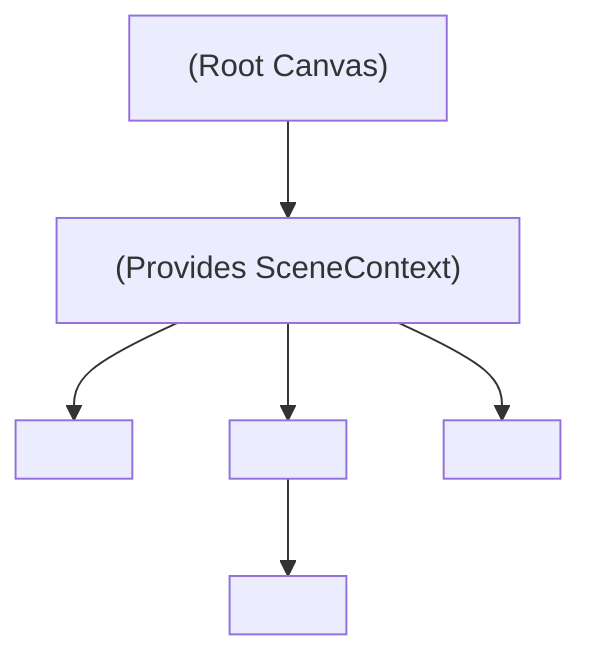

# Declarative React Scene Architecture Design (Stub)

## 1. Overview & Architectural Goals

### Purpose
This document provides the high-level architectural stub for declarative React bindings built on top of the programmatic 3D scene engine. While dynamic games or large worlds with thousands of moving entities benefit from direct programmatic control, lightweight presentation experiences (such as scenic tours, landing pages, and interactive product showcases) benefit from declarative JSX composition.

### Key Architectural Principles
- **Thin Declarative Wrapper over Programmatic Core:** Declarative JSX components do not implement rendering logic. They act as declarative lifecycles that instantiate, configure, and attach programmatic `SceneNode`, `Camera`, `MeshGeometry`, and `Material` instances.
- **Zero Render-Loop Overhead:** React component re-renders must never trigger GPU buffer re-allocations or shader re-compilations. Prop changes (such as position or color) mutate the underlying programmatic instances directly.
- **Hierarchical React Context:** A `<Scene>` component provides a React Context (`SceneContext`) through which child components (`<PerspectiveCamera>`, `<ModelInstance>`, `<Group>`) register themselves into the underlying scene graph.
- **Deferred Deep Dive:** This document serves as the architectural foundation and stub. Detailed prop-diffing mechanics, pointer/raycasting event systems, and layout hooks will be explored in a dedicated deep-dive design phase.

---

## 2. High-Level Component Hierarchy



---

## 3. Proposed Directory Layout & Module Structure

All declarative React bindings will reside in `src/scene/react/`:

- **React Type Definitions:**
  - [`src/scene/react/scene_react_types.ts`](scene_react_types.ts): Props contracts for `<Scene>`, `<Group>`, `<PerspectiveCamera>`, and `<ModelInstance>`.
- **Context & Hooks:**
  - [`src/scene/react/scene_context.ts`](scene_context.ts): React Context delivering active `Scene` and `Camera` references to children.
  - [`src/scene/react/use_scene_node.ts`](use_scene_node.ts): Hook managing lifecycle attachment of a `SceneNode` to its parent.
- **Declarative Components:**
  - [`src/scene/react/scene_component.tsx`](scene_component.tsx): Declarative `<Scene />` component wrapping [`<ScenePass />`](../renderer/scene_pass.tsx).
  - [`src/scene/react/group_component.tsx`](group_component.tsx): Declarative `<Group />` mapping to `SceneNode`.
  - [`src/scene/react/camera_component.tsx`](camera_component.tsx): Declarative `<PerspectiveCamera />` component.
  - [`src/scene/react/model_instance_component.tsx`](model_instance_component.tsx): Declarative `<ModelInstance />` component.

---

## 4. Preliminary API & Type Specifications

```typescript
import React from "react";
import type { ISceneNode } from "../core/scene_node_types";
import type { IMeshGeometry } from "../models/mesh_geometry_types";
import type { IMaterial } from "../materials/material_types";

export type Vector3Tuple = [x: number, y: number, z: number];
export type EulerTuple = [pitch: number, yaw: number, roll: number];

export interface NodeProps {
    /** Position in local coordinates */
    position?: Vector3Tuple;
    /** Euler rotation in radians (YXZ order) */
    rotation?: EulerTuple;
    /** Scale tuple or uniform scalar */
    scale?: Vector3Tuple | number;
    /** Local visibility */
    visible?: boolean;
    /** Children scene nodes */
    children?: React.ReactNode;
}

export interface ModelInstanceProps extends NodeProps {
    /** Target geometry defining vertex layout and buffers */
    geometry: IMeshGeometry;
    /** Target material defining shader, uniforms, and pipeline state */
    material: IMaterial;
    /** Explicit render ordering */
    renderOrder?: number;
}
```

---

## 5. Declarative JSX Usage Vision

```tsx
<WebGLCanvas options={{ autoClear: true, clearColor: [0, 0, 0, 1] }}>
    <Scene>
        <PerspectiveCamera position={[0, 15, 60]} fov={60} />
        
        {/* Opaque 3D Model Instance */}
        <ModelInstance 
            position={[10, 0, -20]}
            rotation={[0, Math.PI / 4, 0]}
            geometry={shipGeometry} 
            material={shipMaterial} 
            renderOrder={0}
        />

        {/* Specialized Galaxy Starfield */}
        <ModelInstance 
            geometry={galaxyGeometry} 
            material={galaxyMaterial} 
            renderOrder={10}
        />
    </Scene>
</WebGLCanvas>
```

---

## 6. Topics Reserved for Dedicated Deep Dive

The following topics will be elaborated in a dedicated design phase:
- **Prop-Diffing Lifecycle:** Efficiently reconciling changes to `position`, `rotation`, and `scale` props without recreating nodes.
- **Declarative Shaders & Materials:** Allowing `<UnlitMaterial color="#ffaa00" />` as inline JSX children of `<ModelInstance>`.
- **Event Handling & Raycasting:** Passing pointer events (`onClick`, `onPointerOver`) to 3D model instances.
- **Animation Integration:** Bridging React state and spring/lerp libraries (e.g. framer-motion or custom tick hooks) with node transforms.
