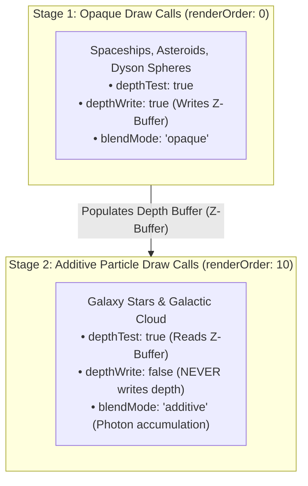
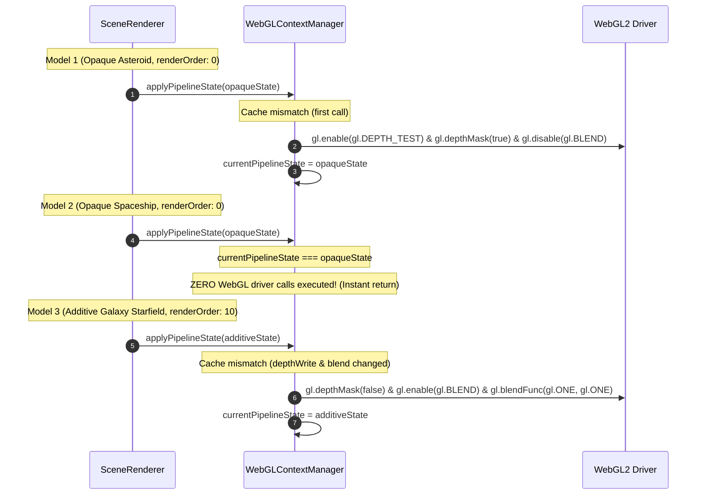
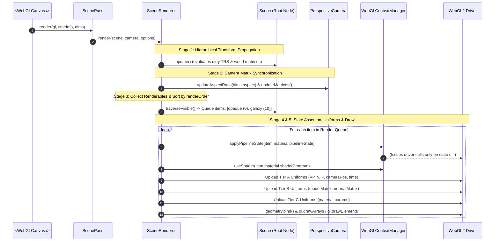

# Scene Rendering Pipeline & Shader Uniform Standard Design

## 1. Overview & Design Goals

### Purpose
This document specifies the architectural design for the Scene Rendering Pipeline and Shader Uniform Standard. It defines how the scene graph, camera, geometry, and materials are coordinated and executed during frame rendering, and how the scene connects to the existing [`<WebGLCanvas />`](../../components/webgl_canvas/webgl_canvas.tsx) multi-pass compositor.

### Key Architectural Principles
- **Predictable Forward Rendering with Explicit `renderOrder`:** The renderer avoids complex, opaque batch-reordering or dynamic vertex buffer packing. By default, objects render in scene-graph tree order, with an optional explicit `renderOrder: number` to guarantee layering (e.g. background $\to$ opaque meshes $\to$ additive particles $\to$ HUD).
- **Centralized Pipeline State Management in `WebGLContextManager`:** Much like shaders and vertex buffers, the active WebGL pipeline state (`depthTest`, `depthWrite`, `blendMode`, `cullFace`) is managed and cached directly by [`WebGLContextManager`](../../webgl/core/context_manager.ts). Redundant GPU driver calls are automatically suppressed when consecutive models share identical pipeline states.
- **Mixed-Depth Composition for Additive Stars & Opaque Geometry:** Enables flying through the galaxy while rendering solid 3D models (spaceships, asteroids, dyson spheres). Opaque objects write to depth; additive stars test against depth but disable depth writing (`depthMask: false`), preserving 100% of the galaxy's blazing radiance.
- **Three-Tier Uniform Distribution Protocol:** Standardized separation between Frame/Camera uniforms, Instance Transform uniforms, and Material-specific domain uniforms.
- **First-Class Canvas Integration:** A lightweight `<ScenePass />` component subscribes the entire 3D scene to the canvas via [`useWebGLPass`](../../components/webgl_canvas/use_webgl_pass.ts), automatically handling canvas resizing, device pixel ratio, and context loss recovery.

---

## 2. Ownership & Parameter Assignment Matrix

To ensure crisp system boundaries, responsibilities for state, order, and execution are partitioned as follows:

- **`Material` (Declarative State Owner):**
  - **Responsibility:** Declares the visual and physical properties of a surface. It is purely a declarative configuration object and issues zero WebGL driver calls directly.
  - **Parameters:** `pipelineState: PipelineState` containing:
    - `blendMode`: `"opaque" | "alpha" | "additive"`
    - `depthTest`: boolean (enables/disables Z-buffer depth testing)
    - `depthWrite`: boolean (controls `gl.depthMask`)
    - `cullFace`: boolean (enables/disables backface culling)
- **`ModelInstance` (Scene Composition Layering Owner):**
  - **Responsibility:** Dictates rendering sequence and spatial placement in the scene graph.
  - **Parameters:** `renderOrder: number` (defaults to `0`). Materials can provide a suggested default (e.g., `UnlitMaterial` defaults to `0`, `GalaxyMaterial` defaults to `10`), but developers can override it per instance.
- **`WebGLContextManager` (GPU State Caching & Deduplication Authority):**
  - **Responsibility:** Tracks the active GPU state on the WebGL context. When `applyPipelineState(desired)` is called, it compares against `currentPipelineState` and only issues WebGL driver calls for properties that actually changed.
- **`SceneRenderer` (Orchestration & Execution):**
  - **Responsibility:** Traverses visible nodes, sorts the queue by `renderOrder`, delegates state assertion to `contextManager.applyPipelineState()`, uploads uniform values, and issues draw calls.

---

## 3. Mixed-Depth Composition: Additive Particles & Opaque Geometry

When flying a camera through a 3D scene that contains both solid structures (asteroids, spacecraft, space stations) and additive volumetric particles (galaxy stars, dust clouds):



### Depth Testing Rules & Visual Behavior
- **Depth-Read Without Depth-Write (`depthTest: true`, `depthWrite: false`):**
  - **Stars Behind Opaque Objects:** The depth test fails because the solid hull is closer to the camera. The star is properly occluded behind the asteroid or ship.
  - **Stars In Front of Opaque Objects:** The depth test passes. The star additively illuminates the pixels in front of the hull.
  - **Stars Relative to Other Stars:** Because `depthWrite: false` is asserted, stars never write depth values. Background stars continue to shine additively through foreground stars without occlusion or clipping artifacts.
- **Historical Standalone Mode vs. Unified Scene Mode:**
  - **Historical Standalone Mode (Home Page Backdrop):** Configured with `depthTest: false`, `depthWrite: false`. Acts as an isolated background without requiring a depth buffer.
  - **Unified Scene Mode (3D Interactive Exploration):** Configured with `depthTest: true`, `depthWrite: false`, `renderOrder: 10`. Allows solid meshes to exist inside the galactic disk.
- **Near-Plane Dissolve Protection:**
  - When the camera flies directly through star clusters, stars softly dissolve via `u_nearFadeDistance` in [`galaxy_pinprick.vert`](../../galaxy_backdrop/shaders/galaxy_pinprick.vert) and clamp their point size via `u_maxPointSize`, preventing sudden popping or screen-filling quads.

---

## 4. WebGLContextManager Pipeline State Management

Much like `useShader(shader)` caches the active program handle, `WebGLContextManager` manages `PipelineState`:



### Depth Buffer Clearing Guard
In WebGL, `gl.clear(gl.DEPTH_BUFFER_BIT)` is ignored by the GPU if `depthMask` is set to `false`. 
Before clearing the depth buffer at the beginning of a pass, `SceneRenderer` or `ScenePass` calls `contextManager.setDepthMask(true)` ensuring the depth clear takes effect.

### Cooperative Multi-Pass State Management
Rather than forcing arbitrary driver resets between passes, all passes and materials cooperatively assert their pipeline state through `contextManager.applyPipelineState()`. This enables `WebGLContextManager` to cleanly track and apply driver transitions (for example, transitioning from `GalacticCloudRenderer`'s alpha blending to `GalaxyMaterial`'s additive blending) without state collisions or redundant GL driver calls.

---

## 5. The 5-Stage Frame Rendering Loop

Each animation frame tick executed by `SceneRenderer.render(scene, camera, options)` follows a strict 5-stage pipeline:



### Stage Breakdown
1. **Stage 1 (Transform Propagation):** Calls `scene.update()`. Traverses the scene graph and resolves all dirty local and world transformation matrices.
2. **Stage 2 (Camera Synchronization):** Automatically updates the camera's aspect ratio from `dims.aspect`, inverts the camera world matrix to compute `viewMatrix` ($V$), and pre-multiplies $\mathbf{VP} = \mathbf{P} \cdot \mathbf{V}$ on the CPU.
3. **Stage 3 (Visibility Filtering & Stable Sort):** Traverses the scene graph collecting all `ModelInstance` nodes where `computedVisible === true`. Performs a stable sort on `renderOrder` (preserving tree insertion order for ties).
4. **Stage 4 (Pipeline State Assertion):** Passes `material.pipelineState` to `contextManager.applyPipelineState()`, deduplicating driver calls.
5. **Stage 5 (Texture Binding, Uniform Upload & Draw Call):**
   - Synchronizes material textures via `contextManager.textures.bind(unit, texture, "white")`. Defaults unit 0 to white fallback if unassigned.
   - Activates shader program, uploads standard (Tier A/B) and material (Tier C) uniforms, binds the geometry VAO, and issues the WebGL draw call.

---

## 6. Uniform & Texture Distribution Protocol

The uniform and texture distribution protocol standardizes naming and binding conventions across all shaders:

### Tier A: Frame & Camera Uniforms (Uploaded Once Per Shader Per Frame)
- `uniform mat4 u_viewProjectionMatrix`: Pre-multiplied $P \times V$ matrix.
- `uniform mat4 u_viewMatrix`: Camera world-to-view matrix (for distance attenuation and fog).
- `uniform mat4 u_projectionMatrix`: Camera view-to-clip matrix.
- `uniform vec3 u_cameraPosition`: Camera world coordinates $(x, y, z)$.
- `uniform float u_time`: Total elapsed time in seconds.
- `uniform float u_viewportHeight`: Physical height in pixels (for distance-scaled point sizing).

### Tier B: Instance Transform Uniforms (Uploaded Per Model Instance)
- `uniform mat4 u_modelMatrix`: Node's `worldMatrix` transforming model space to world space.
- `uniform mat4 u_modelViewMatrix`: Pre-multiplied $V \times M$ matrix for view-space calculations.
- `uniform mat3 u_normalMatrix`: Inverse-transpose of the $3 \times 3$ model matrix for lighting normals.

### Tier C: Material Domain Uniforms (Uploaded From Material Dictionary)
- Custom domain uniforms extracted via `material.getUniforms()` (e.g. `u_color`, `u_rotationSpeed`, `u_pointScale`).

### Tier D: Semantic Texture Slots (`TextureUnit` 0 to 15)
- **`TextureUnit.Color0` / `Color` (Unit 0, `u_texture`, `u_colorMap0`, `u_diffuseMap`):** Primary base color, diffuse, or albedo map.
- **`TextureUnit.Color1` (Unit 1, `u_colorMap1`, `u_texture1`, `u_diffuseMap1`):** Layer 2 secondary diffuse / color blend map.
- **`TextureUnit.Color2` (Unit 2, `u_colorMap2`, `u_texture2`, `u_diffuseMap2`):** Layer 3 tertiary diffuse / color blend map.
- **`TextureUnit.Color3` (Unit 3, `u_colorMap3`, `u_texture3`, `u_diffuseMap3`):** Layer 4 quaternary diffuse / color blend map.
- **`TextureUnit.Normal` (Unit 4, `u_normalMap`):** Tangent-space normal map.
- **`TextureUnit.Roughness` (Unit 5, `u_roughnessMap`):** PBR surface roughness / specular map.
- **`TextureUnit.Metallic` (Unit 6, `u_metallicMap`, `u_metalnessMap`):** PBR surface metalness / conductivity map.
- **`TextureUnit.Emissive` (Unit 7, `u_emissiveMap`):** Emissive self-illumination glow map.
- **`TextureUnit.Occlusion` (Unit 8, `u_aoMap`, `u_occlusionMap`):** Ambient occlusion / cavity shadow map.
- **`TextureUnit.Height` (Unit 9, `u_heightMap`, `u_bumpMap`):** Displacement / parallax bump height map.
- **`TextureUnit.Mask` (Unit 10, `u_maskMap`, `u_splatMap`, `u_blendMask`):** Alpha cutoff / multi-layer splat / blend mask.
- **`TextureUnit.Environment` (Unit 11, `u_envMap`, `u_irradianceMap`):** Image-based lighting / sky reflection cubemap.
- **`TextureUnit.ShadowMap` (Unit 12, `u_shadowMap`):** Directional / spot light shadow depth map.
- **`TextureUnit.Transmission` (Unit 13, `u_transmissionMap`, `u_thicknessMap`):** Glass / water / subsurface transmission and refraction map.
- **`TextureUnit.Lut` (Unit 14, `u_brdfLut`, `u_lutMap`):** Split-sum BRDF lookup table or color grading LUT.
- **`TextureUnit.Noise` (Unit 15, `u_noiseMap`, `u_flowMap`, `u_distortionMap`):** Procedural noise, flow vectors, or distortion map for VFX.
- State caching in `WebGLContextManager` suppresses redundant `gl.activeTexture()` and `gl.bindTexture()` calls across sequential instances.
- Shaders automatically link to these slots at compile time via GPU active uniform reflection in `ShaderProgram`.

---

## 7. Directory Layout & Module Structure

All rendering pipeline code resides in `src/scene/renderer/` and updates in `src/webgl/`:

- **Context Manager Updates (`src/webgl/`):**
  - [`src/webgl/core/context_manager_types.ts`](../../webgl/core/context_manager_types.ts): Adds `applyPipelineState(state)` and `resetPipelineState()` methods.
  - [`src/webgl/core/context_manager.ts`](../../webgl/core/context_manager.ts): Implements state caching for `depthTest`, `depthWrite`, `blendMode`, and `cullFace`.
- **Renderer Type Definitions (`src/scene/renderer/`):**
  - [`src/scene/renderer/scene_renderer_types.ts`](scene_renderer_types.ts): Contracts for `ISceneRenderer`, `RenderQueueItem`, and `StandardShaderUniforms`.
- **Core Scene Renderer (`src/scene/renderer/`):**
  - [`src/scene/renderer/scene_renderer.ts`](scene_renderer.ts): Core class executing traversal, sorting, state switching, uniform distribution, and drawing.
- **Pass Component & Types (`<WebGLCanvas />` Bridge):**
  - [`src/scene/renderer/scene_pass_types.ts`](scene_pass_types.ts): Props interface for `<ScenePass />`.
  - [`src/scene/renderer/scene_pass.tsx`](scene_pass.tsx): React pass component subscribing `SceneRenderer` lifecycle to `<WebGLCanvas />` via [`useWebGLPass`](../../components/webgl_canvas/use_webgl_pass.ts).

---

## 8. API & Type Specifications

### Context Manager Extensions (`src/webgl/core/context_manager_types.ts`)

```typescript
import type { PipelineState } from "../scene/materials/material_types";

export interface IWebGLContextManager {
    // ... existing shader & buffer methods ...
    
    /** Asserts desired WebGL pipeline state; skips redundant driver calls */
    applyPipelineState(state: PipelineState): void;
    
    /** Resets cached pipeline state to default or canvas baseline */
    resetPipelineState(): void;
    
    /** Forces depth mask true or false (e.g. before clearing depth buffer) */
    setDepthMask(enabled: boolean): void;

    /** Binds a WebGLTexture to a hardware texture unit with redundant call skipping */
    bindTexture(unit: number, texture: WebGLTexture | null): void;

    /** Retrieves the shared 1x1 solid white fallback texture handle */
    getDefaultWhiteTexture(): WebGLTexture | null;

    /** Maximum hardware texture units supported in fragment shaders */
    readonly maxTextureUnits: number;
}
```

### Renderer Interfaces (`src/scene/renderer/scene_renderer_types.ts`)

```typescript
import type { IScene } from "../core/scene_types";
import type { ICamera } from "../camera/camera_types";
import type { IModelInstance } from "../models/model_instance_types";
import type { CanvasDimensions, TimeInfo } from "../../components/webgl_canvas/types";
import type { IWebGLContextManager } from "../../webgl/core/context_manager_types";

export interface StandardShaderUniforms {
    u_viewProjectionMatrix: Float32Array;
    u_viewMatrix: Float32Array;
    u_projectionMatrix: Float32Array;
    u_cameraPosition: [number, number, number];
    u_modelMatrix: Float32Array;
    u_modelViewMatrix: Float32Array;
    u_normalMatrix?: Float32Array;
    u_time: number;
    u_viewportHeight: number;
}

export interface RenderQueueItem {
    instance: IModelInstance;
    renderOrder: number;
}

export interface RenderOptions {
    timeInfo: TimeInfo;
    dimensions: CanvasDimensions;
    clearDepth?: boolean;
}

export interface ISceneRenderer {
    readonly contextManager: IWebGLContextManager;
    render(scene: IScene, camera: ICamera, options: RenderOptions): void;
    reset(): void;
}
```

---

## 9. Declarative React Bridge Example

```tsx
import React, { useMemo } from "react";
import { WebGLCanvas } from "../components/webgl_canvas/webgl_canvas";
import { ScenePass } from "./renderer/scene_pass";
import { Scene } from "./core/scene";
import { PerspectiveCamera } from "./camera/perspective_camera";
import { ModelInstance } from "./models/model_instance";
import { SphereGeometry } from "./models/primitives/sphere_geometry";
import { UnlitMaterial } from "./materials/unlit_material";
import { GalaxyGeometry } from "./models/specialized/galaxy_geometry";
import { GalaxyMaterial } from "./materials/specialized/galaxy_material";

export function SpaceExplorationView(): React.JSX.Element {
    const { scene, camera } = useMemo(() => {
        const scn = new Scene();
        const cam = new PerspectiveCamera({ fov: 60, near: 0.1, far: 2000 });
        cam.transform.setPosition(0, 15, 60);
        cam.lookAt({ x: 0, y: 0, z: 0 });

        // 1. Add Opaque Spacecraft (renderOrder: 0, writes depth)
        const shipGeo = new SphereGeometry({ radius: 3, segments: 16 });
        const shipMat = new UnlitMaterial({ 
            pipelineState: { depthTest: true, depthWrite: true, blendMode: "opaque" }
        });
        const ship = new ModelInstance(shipGeo, shipMat);
        ship.renderOrder = 0;
        scn.add(ship);

        // 2. Add Galaxy Starfield Backdrop (renderOrder: 10, reads depth, never writes depth)
        const galaxyGeo = new GalaxyGeometry();
        const galaxyMat = new GalaxyMaterial({ 
            shaderKey: "galaxy_pinprick",
            pipelineState: { depthTest: true, depthWrite: false, blendMode: "additive" }
        });
        const galaxy = new ModelInstance(galaxyGeo, galaxyMat);
        galaxy.renderOrder = 10;
        scn.add(galaxy);

        return { scene: scn, camera: cam };
    }, []);

    return (
        <WebGLCanvas options={{ autoClear: true, clearColor: [0, 0, 0, 1] }}>
            <ScenePass scene={scene} camera={camera} priority={0} clearDepth={true} />
        </WebGLCanvas>
    );
}
```
