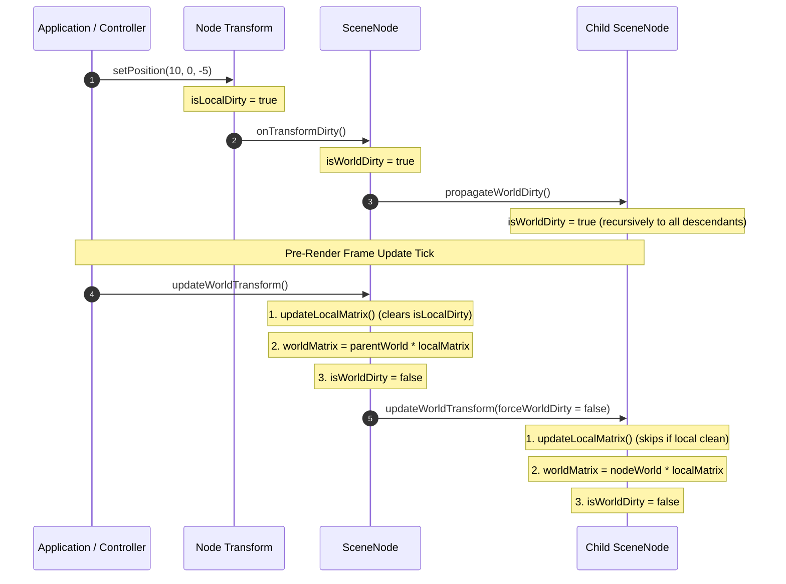

# Transform Hierarchy & Scene Graph Design

## 1. Overview & Design Goals

### Purpose
This document specifies the mathematical foundation, data contracts, and algorithmic behavior for the 3D Transform Hierarchy and Scene Graph. It establishes how objects and cameras are spatially arranged, transformed, parented, and updated prior to rendering.

### Key Architectural Principles
- **Dual Rotation Interface with Internal Quaternion Storage:** All 3D rotations are stored internally as normalized quaternions $\mathbf{q} = [x, y, z, w]$. The external API provides both an intuitive Euler angle interface (pitch, yaw, roll in radians with standard YXZ order) and a direct quaternion interface for smooth spherical linear interpolation (slerp).
- **Zero-Garbage Method-Based Mutation:** Transform updates are performed via explicit methods (`setPosition`, `setRotationEuler`, `setScale`) rather than Proxy-wrapped object properties, eliminating garbage collection pressure and ensuring deterministic dirty-flag trips.
- **Two-Tier Lazy Evaluation:** 
  - Local TRS matrix is recomputed only when local properties change (`isLocalDirty`).
  - World matrix is recomputed only when the local matrix or an ancestor's world matrix changes (`isWorldDirty`), avoiding redundant matrix multiplications for static nodes.
- **Hierarchical Visibility Pruning:** Visibility cascades down the scene graph. If an ancestor is marked `visible = false`, its entire subtree is skipped during pre-render updates and draw passes.
- **Lightweight Class Inheritance:** `SceneNode` serves as the lightweight spatial base class, extended by specialized entities (`GroupNode`, `ModelInstance`, and `CameraNode`).
- **Strict Separation of Types:** Interfaces are declared in dedicated `*_types.ts` files to prevent circular dependencies.

---

## 2. Coordinate Conventions & Mathematical Specifications

### Coordinate System
The engine uses a standard right-handed Cartesian coordinate system:
- $+X$: Points right.
- $+Y$: Points up.
- $+Z$: Points backward (toward the viewer).
- $-Z$: Default forward viewing and heading direction.

### Internal Quaternion Representation
Rotations are stored as 4-element unit quaternions $\mathbf{q} = [x, y, z, w]$ satisfying:

$$x^2 + y^2 + z^2 + w^2 = 1$$

To avoid hand-rolling complex quaternion mathematics and edge-case handling, the engine leverages `gl-matrix` for unit quaternion arithmetic, conversion, and slerp interpolation.

### Euler Angle Conversion (YXZ Order)
For intuitive manipulation, callers can set and get rotations via Euler angles:
- **Pitch ($\theta_x$):** Rotation around the local X axis (nodding up/down).
- **Yaw ($\theta_y$):** Rotation around the local Y axis (turning left/right).
- **Roll ($\theta_z$):** Rotation around the local Z axis (banking/tilting side to side).

Euler angles are composed in **YXZ** order (Yaw $\rightarrow$ Pitch $\rightarrow$ Roll). The resulting orientation quaternion is:

$$\mathbf{q} = \mathbf{q}_y(\theta_y) \cdot \mathbf{q}_x(\theta_x) \cdot \mathbf{q}_z(\theta_z)$$

This order ensures that horizontal yaw (heading) remains independent of vertical pitch (elevation), which is ideal for both camera controls and vehicle/spacecraft orientation.

### Local Transformation Matrix ($M_{\text{local}}$)
The local transform matrix is synthesized from Translation ($T$), Quaternion Rotation ($R$), and Scale ($S$):

$$M_{\text{local}} = T(p_x, p_y, p_z) \cdot R(\mathbf{q}) \cdot S(s_x, s_y, s_z)$$

Given quaternion $\mathbf{q} = [x, y, z, w]$, translation $\mathbf{p} = [p_x, p_y, p_z]$, and scale $\mathbf{s} = [s_x, s_y, s_z]$, the column-major $4 \times 4$ matrix is:

$$M_{\text{local}} = \begin{bmatrix}
(1 - 2y^2 - 2z^2) \cdot s_x & (2xy + 2wz) \cdot s_x & (2xz - 2wy) \cdot s_x & 0 \\
(2xy - 2wz) \cdot s_y & (1 - 2x^2 - 2z^2) \cdot s_y & (2yz + 2wx) \cdot s_y & 0 \\
(2xz + 2wy) \cdot s_z & (2yz - 2wx) \cdot s_z & (1 - 2x^2 - 2y^2) \cdot s_z & 0 \\
p_x & p_y & p_z & 1
\end{bmatrix}^T$$

*(Note: Stored in column-major order in `Float32Array(16)` matching WebGL2 and `gl-matrix` standards).*

### Hierarchical World Matrix Composition ($M_{\text{world}}$)
For any node in the graph:
- If the node has no parent (root node):
  $$M_{\text{world}} = M_{\text{local}}$$
- If the node has a parent:
  $$M_{\text{world}} = M_{\text{parent, world}} \cdot M_{\text{local}}$$

---

## 3. Directory Layout & File Responsibilities

All transform and scene graph code resides in `src/maths/` and `src/scene/core/`:

- **Math Vector Layer:**
  - [`src/maths/vector_types.ts`](../maths/vector_types.ts): Type definitions for `Vector3Like` and vector operands.
  - [`src/maths/vector.ts`](../maths/vector.ts): High-performance vector utility functions (add, sub, dot, cross, normalize, length, distance, lerp).
- **Transform Layer:**
  - [`src/scene/core/transform_types.ts`](core/transform_types.ts): Data contracts for Euler angles, quaternions, and the `ITransform` interface.
  - [`src/scene/core/transform.ts`](core/transform.ts): The `Transform` class managing TRS data, `gl-matrix` conversions, and local matrix synthesis.
- **Scene Node Hierarchy Layer:**
  - [`src/scene/core/scene_node_types.ts`](core/scene_node_types.ts): Contracts for node hierarchy, traversal callbacks, and options.
  - [`src/scene/core/scene_node.ts`](core/scene_node.ts): Base `SceneNode` class implementing parent-child relationships, world matrix caching, and visibility cascading.
  - [`src/scene/core/group_node.ts`](core/group_node.ts): Lightweight empty node used for scene organization and compound rotation pivots.
- **Scene Container Layer:**
  - [`src/scene/core/scene_types.ts`](core/scene_types.ts): Contracts for the root `Scene` container and active camera registry.
  - [`src/scene/core/scene.ts`](core/scene.ts): The top-level `Scene` container managing root nodes and frame update passes.

---

## 4. API & Type Specifications

### Vector Interfaces (`src/maths/vector_types.ts`)

```typescript
export interface Vector3Like {
    x: number;
    y: number;
    z: number;
}

export type ReadonlyVector3Like = Readonly<Vector3Like>;
```

### Transform Interfaces (`src/scene/core/transform_types.ts`)

```typescript
import type { Vector3Like } from "../../maths/vector_types";

export type QuaternionTuple = [x: number, y: number, z: number, w: number];

export interface EulerAngles {
    /** Pitch in radians (rotation around X axis) */
    pitch: number;
    /** Yaw in radians (rotation around Y axis) */
    yaw: number;
    /** Roll in radians (rotation around Z axis) */
    roll: number;
}

export interface ITransform {
    /** Column-major 4x4 local transformation matrix */
    readonly localMatrix: Float32Array;
    
    /** Returns a copy of the current local position */
    getPosition(): Vector3Like;
    
    /** Returns a copy of the current internal quaternion [x, y, z, w] */
    getQuaternion(): QuaternionTuple;
    
    /** Computes and returns current Euler angles (YXZ order) */
    getEulerAngles(): EulerAngles;
    
    /** Returns a copy of the current local scale */
    getScale(): Vector3Like;
    
    /** Sets local position coordinates */
    setPosition(x: number, y: number, z: number): this;
    
    /** Sets local rotation from Euler angles (YXZ composition) */
    setRotationEuler(pitch: number, yaw: number, roll: number): this;
    
    /** Sets local rotation directly from unit quaternion */
    setRotationQuaternion(x: number, y: number, z: number, w: number): this;
    
    /** Spherical linear interpolation towards target quaternion */
    slerp(target: QuaternionTuple, t: number): this;
    
    /** Sets local non-uniform scale */
    setScale(sx: number, sy: number, sz: number): this;
    
    /** Sets local uniform scale */
    setUniformScale(s: number): this;
    
    /** Recomputes localMatrix if isDirty is true */
    updateLocalMatrix(): boolean;
}
```

### Scene Node Interfaces (`src/scene/core/scene_node_types.ts`)

```typescript
import type { ITransform } from "./transform_types";

export type NodeTraverseCallback = (node: ISceneNode) => void;

export interface ISceneNode {
    /** Unique identifier */
    readonly id: string;
    
    /** Human-readable label for debugging */
    name: string;
    
    /** Spatial transform relative to parent */
    readonly transform: ITransform;
    
    /** Cached column-major 4x4 world transformation matrix */
    readonly worldMatrix: Float32Array;
    
    /** Parent node (null if root or detached) */
    readonly parent: ISceneNode | null;
    
    /** List of direct child nodes */
    readonly children: readonly ISceneNode[];
    
    /** Local visibility flag */
    visible: boolean;
    
    /** Effective visibility inheriting parent state */
    readonly computedVisible: boolean;
    
    /** Adds a child node to this hierarchy */
    addChild(child: ISceneNode): this;
    
    /** Removes a child node from this hierarchy */
    removeChild(child: ISceneNode): boolean;
    
    /** Removes this node from its parent */
    removeFromParent(): void;
    
    /** Traverses this node and all descendants in depth-first order */
    traverse(callback: NodeTraverseCallback): void;
    
    /** Recursively updates local and world transformation matrices */
    updateWorldTransform(forceWorldDirty?: boolean): void;
    
    /** Frees node resources */
    destroy(): void;
}
```

### Scene Container Interfaces (`src/scene/core/scene_types.ts`)

```typescript
import type { ISceneNode } from "./scene_node_types";

export interface IScene {
    /** Root container node */
    readonly root: ISceneNode;
    
    /** Adds top-level nodes to the scene */
    add(node: ISceneNode): this;
    
    /** Removes nodes from the scene */
    remove(node: ISceneNode): boolean;
    
    /** Updates transforms for the entire graph */
    update(): void;
    
    /** Traverses all visible nodes in the scene */
    traverseVisible(callback: (node: ISceneNode) => void): void;
    
    /** Clears all scene nodes and frees resources */
    clear(): void;
}
```

---

## 5. Algorithms & Lifecycle Procedures

### Two-Tier Dirty Flag Propagation Flow



### 1. Dirty Flag Invalidation Procedure
- **Trigger:** Calling `setPosition()`, `setRotationEuler()`, `setRotationQuaternion()`, `setScale()`, or `slerp()`.
- **Step 1:** The `Transform` instance sets its internal flag: `isLocalDirty = true`.
- **Step 2:** The `Transform` fires its registered `onDirty` callback, bound to its owning `SceneNode`.
- **Step 3:** The owning `SceneNode` sets its flag: `isWorldDirty = true`.
- **Step 4:** The node iterates over its `children` array and recursively invokes `child.markWorldDirty()`, ensuring all descendants flag `isWorldDirty = true`. Notice this does *not* recompute matrices immediately—it merely trips the boolean flags.

### 2. World Transform Evaluation Procedure (`updateWorldTransform`)
- **Step 1 (Local Matrix):** If `transform.isLocalDirty` is true, re-evaluate local TRS via `gl-matrix` (`mat4.fromRotationTranslationScale`) and reset `isLocalDirty = false`.
- **Step 2 (World Matrix):** If `isWorldDirty` or caller passed `forceWorldDirty = true`:
  - If node has no parent: copy `localMatrix` directly into `worldMatrix`.
  - If node has a parent: multiply `parent.worldMatrix` by `localMatrix` into `worldMatrix`.
  - Reset `isWorldDirty = false`.
- **Step 3 (Children Propagation):** For each child in `children`:
  - Recalculate child's `computedVisible = this.computedVisible && child.visible`.
  - If `child.computedVisible` is false, child updates can optionally be deferred.
  - Call `child.updateWorldTransform(wasWorldMatrixRecomputed)`.

### 3. Reparenting Procedure (`parent.addChild`)
- When a node is attached to a new parent:
  - If it already has an existing parent, call `previousParent.removeChild(node)`.
  - Attach node to new parent's `children` array and set `node.parent = newParent`.
  - Mark `node.markWorldDirty()` to ensure its world matrix is re-composed against the new parent on the subsequent frame.

---

## 6. Interaction with Upstream & Downstream Subsystems

- **Upstream Controllers & Animation:**
  - Input controllers (keyboard, pointer, gyroscope) call `transform.setPosition()` or `transform.setRotationEuler()` on nodes.
  - Keyframe paths and animation loops call `transform.slerp()` to smoothly orient objects or cameras along a trajectory.
- **Downstream Camera System (`Priority 2`):**
  - A `CameraNode` extends `SceneNode`. The camera reads its own `worldMatrix` to invert it into the standard View Matrix:
    $$\mathbf{V} = (M_{\text{camera, world}})^{-1}$$
- **Downstream Model Instances (`Priority 3`):**
  - A `ModelInstance` extends `SceneNode`. When drawn, it passes its `worldMatrix` directly into the vertex shader as `u_modelMatrix`.
- **Downstream Scene Renderer (`Priority 4`):**
  - The renderer calls `scene.update()` once at the start of each frame tick before traversing visible renderable instances.
