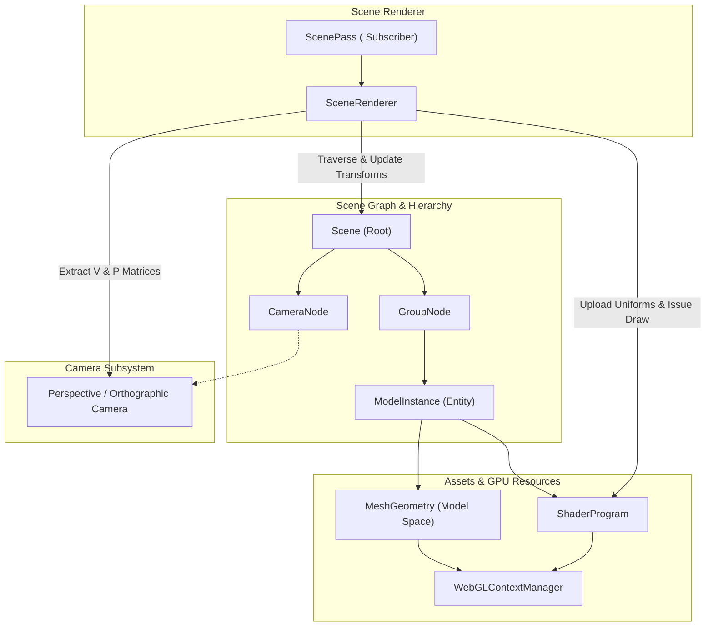

# Scene Engine & Camera Architecture Overview Design

## 1. Executive Summary & Design Goals

### Overview
This document outlines the architectural blueprint for a modern, decoupled 3D Scene and Camera system in the rendering engine. Previously, individual renderers and shaders managed their own positioning, projection, and rendering logic internally. This system introduces:
- **Model Space:** Geometries and vertex attributes authored around local coordinates $(0, 0, 0)$.
- **Scene Graph & Transform Hierarchy:** Entities placed into a hierarchical scene with explicit Position, Rotation (Euler angles), and Scale (PRS / TRS).
- **Camera System:** Decoupled viewpoint, orientation, and perspective/orthographic projections providing standard View ($V$) and Projection ($P$) matrices.
- **Unified Shader Transform Pipeline:** Standard uniform bindings ($P \times V \times M_{\text{world}} \times \mathbf{v}_{\text{model}}$) ensuring consistent coordinate spaces across all shaders.
- **Programmatic Core with Declarative Readiness:** Core engine built cleanly in TypeScript for high-performance and dynamic scenes, while establishing the foundation for declarative React JSX wrappers (e.g. scenic camera tours).

### Key Architectural Principles
- **No Hand-Rolled Quaternion Complexity:** Rotations and orientations are managed via intuitive 3D Euler angles (pitch, yaw, roll) and standard $4\times 4$ transform matrices. If advanced spherical interpolation (slerp) is required in the future, a battle-tested library will be imported rather than maintaining custom quaternion math.
- **Separate Types from Implementations:** Every component separates interfaces and data contracts into dedicated `*_types.ts` files to prevent circular dependencies and allow lightweight imports.
- **No Barrel Files:** Modules import directly from specific target files to preserve bundler efficiency and clean dependency trees.
- **Lazy Transform Evaluation:** Hierarchical world transforms use dirty flags (`isDirty`, `worldDirty`) to eliminate redundant matrix multiplications when nodes are static.
- **Integration with Existing WebGL Infrastructure:** Leverages [`src/webgl/core/context_manager.ts`](../webgl/core/context_manager.ts) for GPU resource allocation, [`src/webgl/geometry/vertex_buffer.ts`](../webgl/geometry/vertex_buffer.ts) for VAO management, and [`src/components/webgl_canvas/`](../components/webgl_canvas/) via [`useWebGLPass`](../components/webgl_canvas/use_webgl_pass.ts).

---

## 2. System Architecture & Component Diagram



---

## 3. Directory Layout & Module Structure

All scene and camera components will reside in `src/scene/`, accompanied by vector math extensions in `src/maths/`:

- **Math Extensions (`src/maths/`):**
  - [`src/maths/vector.ts`](../maths/vector.ts) & [`src/maths/vector_types.ts`](../maths/vector_types.ts): Robust 3D vector operations (add, subtract, scale, dot, cross, normalize, length).
  - [`src/maths/matrix.ts`](../maths/matrix.ts): Existing $4\times 4$ column-major matrix utilities, expanded with look-at and TRS matrix generators.
- **Scene Core (`src/scene/core/`):**
  - [`src/scene/core/transform.ts`](core/transform.ts) & [`src/scene/core/transform_types.ts`](core/transform_types.ts): Position, Euler rotation, scale, and local matrix computation.
  - [`src/scene/core/scene_node.ts`](core/scene_node.ts) & [`src/scene/core/scene_node_types.ts`](core/scene_node_types.ts): Hierarchical node with parent/child relationships and world matrix caching.
  - [`src/scene/core/scene.ts`](core/scene.ts) & [`src/scene/core/scene_types.ts`](core/scene_types.ts): Scene container managing node lists and active cameras.
- **Camera Subsystem (`src/scene/camera/`):**
  - [`src/scene/camera/camera.ts`](camera/camera.ts) & [`src/scene/camera/camera_types.ts`](camera/camera_types.ts): Base camera interface and common projection logic.
  - [`src/scene/camera/perspective_camera.ts`](camera/perspective_camera.ts): Perspective projection, FOV, near/far planes.
  - [`src/scene/camera/orthographic_camera.ts`](camera/orthographic_camera.ts): Orthographic bounds for 2D/isometric projections.
  - [`src/scene/camera/camera_controller.ts`](camera/camera_controller.ts) & [`src/scene/camera/camera_controller_types.ts`](camera/camera_controller_types.ts): Orbit, smooth follow, and fly-through controllers.
- **Models & Geometry (`src/scene/models/`):**
  - [`src/scene/models/mesh_geometry.ts`](models/mesh_geometry.ts) & [`src/scene/models/mesh_geometry_types.ts`](models/mesh_geometry_types.ts): Pure model-space vertex data and attribute layout management.
  - [`src/scene/models/model_instance.ts`](models/model_instance.ts) & [`src/scene/models/model_instance_types.ts`](models/model_instance_types.ts): Renderable instance linking geometry, transform, and shader/material.
- **Materials & Textures (`src/scene/materials/`):**
  - [`src/scene/materials/texture_material_system_design.md`](materials/texture_material_system_design.md): 2D texture resources, async image decoding, 1x1 zero-stall fallback, hardware texture unit state caching, and `sampler2D` shader bindings.
- **Renderer & Canvas Bridge (`src/scene/renderer/`):**
  - [`src/scene/renderer/scene_renderer.ts`](renderer/scene_renderer.ts) & [`src/scene/renderer/scene_renderer_types.ts`](renderer/scene_renderer_types.ts): Scene traversal, matrix uniform dispatch, and batch rendering.
  - [`src/scene/renderer/scene_pass.tsx`](renderer/scene_pass.tsx): React pass component integrating with `<WebGLCanvas />`.
- **Declarative React Bindings (`src/scene/react/` - Future Phase):**
  - Declarative JSX components (`<Scene>`, `<Camera>`, `<ModelInstance>`) designed for static tours and scenic presentations.

---

## 4. Standard Shader Transform Pipeline & Uniform Conventions

### Coordinate Transformation Formula
Every vertex in model space passes through the following transformation pipeline:

$$\mathbf{v}_{\text{world}} = \mathbf{M}_{\text{model}} \cdot \mathbf{v}_{\text{model}}$$

$$\mathbf{v}_{\text{view}} = \mathbf{V}_{\text{view}} \cdot \mathbf{v}_{\text{world}}$$

$$\mathbf{v}_{\text{clip}} = \mathbf{P}_{\text{proj}} \cdot \mathbf{v}_{\text{view}} = (\mathbf{P} \cdot \mathbf{V} \cdot \mathbf{M}) \cdot \mathbf{v}_{\text{model}}$$

### Uniform Naming Standards
Shaders adhering to the scene framework will use standardized uniform names:
- `uniform mat4 u_modelMatrix`: Transforms vertices from local model space to global world space ($M$).
- `uniform mat4 u_viewMatrix`: Transforms vertices from world space to camera eye space ($V$).
- `uniform mat4 u_projectionMatrix`: Transforms eye space to clip coordinates ($P$).
- `uniform mat4 u_viewProjectionMatrix`: Pre-multiplied $P \times V$ matrix uploaded once per frame per camera to save vertex shader instructions.
- `uniform mat4 u_modelViewMatrix`: Pre-multiplied $V \times M$ matrix for view-space lighting and fog calculations.
- `uniform mat3 u_normalMatrix`: Inverse-transpose of the upper $3\times 3$ model matrix for lighting normals: $(M^{-1})^T$.
- `uniform vec3 u_cameraPosition`: Camera position in world space for specular highlights and distance fading.

---

## 5. Core Interface Specifications

### Transform & Scene Graph Contracts (`src/scene/core/`)

```typescript
export interface Vector3Like {
    x: number;
    y: number;
    z: number;
}

export interface EulerRotation {
    pitch: number; // Rotation around X (radians)
    yaw: number;   // Rotation around Y (radians)
    roll: number;  // Rotation around Z (radians)
}

export interface ITransform {
    position: Vector3Like;
    rotation: EulerRotation;
    scale: Vector3Like;
    localMatrix: Float32Array;
    isDirty: boolean;
    updateMatrix(): void;
}

export interface ISceneNode {
    id: string;
    parent: ISceneNode | null;
    children: ISceneNode[];
    transform: ITransform;
    worldMatrix: Float32Array;
    visible: boolean;
    addChild(child: ISceneNode): void;
    removeChild(child: ISceneNode): void;
    updateWorldMatrix(parentWorldMatrix?: Float32Array): void;
}
```

### Camera Contracts (`src/scene/camera/`)

```typescript
export interface ICamera {
    viewMatrix: Float32Array;
    projectionMatrix: Float32Array;
    viewProjectionMatrix: Float32Array;
    position: Vector3Like;
    updateMatrices(): void;
    updateProjection(aspect: number): void;
    lookAt(target: Vector3Like, up?: Vector3Like): void;
}
```

### Model & Geometry Contracts (`src/scene/models/`)

```typescript
export interface IMeshGeometry {
    readonly id: string;
    readonly vertexBuffer: VertexBuffer;
    readonly vertexCount: number;
    readonly primitiveType: number; // gl.TRIANGLES, gl.POINTS, etc.
    init(gl: WebGL2RenderingContext): void;
    destroy(): void;
}

export interface IModelInstance extends ISceneNode {
    geometry: IMeshGeometry;
    shaderProgramKey: string;
    render(gl: WebGL2RenderingContext, uniforms: StandardUniforms): void;
}
```

---

## 6. Execution & Render Loop Algorithm

1. **Input & Update Phase:**
   - User inputs or controllers update node transforms or camera positions (e.g. camera flying through space).
   - Nodes flag `isDirty = true` when their translation, rotation, or scale changes.

2. **Hierarchical Transform Propagation:**
   - The scene traverses the node graph starting at the root.
   - If a node or its ancestor is dirty, its `localMatrix` is recalculated ($T \times R \times S$) and multiplied with `parent.worldMatrix` to yield `node.worldMatrix`.

3. **Camera Matrix Update:**
   - Camera updates its `viewMatrix` ($V$) and `projectionMatrix` ($P$).
   - Computes pre-multiplied `viewProjectionMatrix` ($VP = P \times V$).

4. **Scene Traversal & Batching:**
   - The renderer traverses visible renderable nodes in the scene.
   - Nodes are grouped by shader program to minimize GPU state switches.

5. **Draw Execution:**
   - For each shader group:
     - Activate `ShaderProgram` via `WebGLContextManager`.
     - Upload frame-shared uniforms (`u_viewProjectionMatrix`, `u_viewMatrix`, `u_projectionMatrix`, `u_cameraPosition`).
     - For each instance:
       - Upload instance-specific uniforms (`u_modelMatrix`, `u_normalMatrix`).
       - Bind geometry VAO and issue draw call (`gl.drawArrays` or `gl.drawElements`).

---

## 7. Programmatic Scene Usage vs. Future Declarative JSX

### Programmatic API (Primary Engine Target)
Dynamic, interactive scenes with thousands of entities or custom frame updates will be created programmatically:

```typescript
// 1. Initialize Scene and Camera
const scene = new Scene();
const camera = new PerspectiveCamera({ fov: 60, near: 0.1, far: 1000 });
camera.position = { x: 0, y: 15, z: 40 };
camera.lookAt({ x: 0, y: 0, z: 0 });

// 2. Create Geometry and Model Instances
const asteroidGeo = new SphereGeometry({ radius: 2, segments: 16 });
const asteroid = new ModelInstance(asteroidGeo, "pbr_rock_shader");
asteroid.transform.position = { x: 10, y: 0, z: -20 };
asteroid.transform.scale = { x: 1.5, y: 1.5, z: 1.5 };
scene.add(asteroid);

// 3. Mount in Canvas via ScenePass
<WebGLCanvas>
    <ScenePass scene={scene} camera={camera} priority={0} />
</WebGLCanvas>
```

### Declarative JSX Bindings (Future Scenic Tour Target)
For lightweight presentations (such as a spaceship camera tour through a static galaxy):

```tsx
<WebGLCanvas>
    <Scene>
        <PerspectiveCamera position={[0, 10, 50]} fov={60}>
            <CameraTourPath waypoints={TOUR_WAYPOINTS} duration={30} loop />
        </PerspectiveCamera>
        <ModelInstance geometry={galaxyGeometry} shader="galaxy_shader" />
    </Scene>
</WebGLCanvas>
```

---

## 8. Multi-Step Elaboration Roadmap

The implementation will proceed one dedicated design document at a time:

- **Step 1 (Next):** `src/scene/scene_graph_design.md`
  - Deep-dive into Transform math (Euler rotations, TRS composition), SceneNode hierarchy, dirty-flag caching algorithms, and vector helper extensions.
- **Step 2:** `src/scene/camera/camera_system_design.md`
  - Camera implementations (perspective, orthographic), LookAt matrix math, aspect ratio canvas syncing, and camera controllers.
- **Step 3:** `src/scene/models/model_mesh_design.md`
  - Model space specification, MeshGeometry abstractions, resource allocation lifecycle via `WebGLContextManager`, and instanced rendering options.
- **Step 4:** `src/scene/renderer/scene_render_pipeline_design.md`
  - Traversal, sorting, shader uniform distribution, and bridge component (`ScenePass`) for `<WebGLCanvas />`.
- **Step 5:** `src/scene/react/declarative_scene_design.md`
  - Declarative JSX wrappers and camera path interpolators for guided camera tours.
