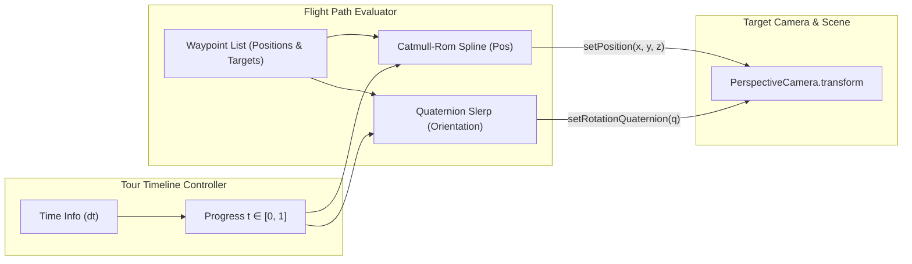

# Galaxy Tour & Camera Animation Design (Stub)

## 1. Overview & Cinematic Vision

### Purpose
This document specifies the architectural stub for the **Galaxy Tour & Camera Flight Path** system. It provides an automated, cinematic camera flight through the 3D spiral galaxy simulation, navigating from deep intergalactic space, diving through dense spiral arms, and orbiting the brilliant galactic core.

### Key Architectural Principles
- **Decoupled from Camera Primitives:** The tour engine does not hardcode camera projection or WebGL logic. It acts as an animator/controller that mutates the `transform` of an existing `PerspectiveCamera`.
- **Smooth Continuous Flight Paths (Splines):** Positions are interpolated across 3D waypoints using Catmull-Rom or cubic spline curves to guarantee $C^1$ velocity continuity and prevent jarring angular snaps.
- **Gimbal-Free Rotation Interpolation (Slerp):** Camera orientations are interpolated using spherical linear interpolation (`slerp`) on unit quaternions, ensuring smooth, shortest-path rotational transitions.
- **Time-Normalized Playback Timeline:** Flight progress is parameterized along a normalized timeline $t \in [0, 1]$, enabling scrubber controls, variable speed, pause/resume, and looping.
- **Deferred Deep Dive:** Detailed waypoint configurations, cinematic easing curves, narrative text overlays, and interactive user override mechanics will be expanded in a dedicated design phase.

---

## 2. Tour Flight Architecture Diagram



---

## 3. Proposed Directory Layout & Module Structure

All camera tour and flight path code will reside in `src/scene/tours/`:

- **Tour Type Definitions:**
  - [`src/scene/tours/galaxy_tour_types.ts`](galaxy_tour_types.ts): Contracts for `TourWaypoint`, `TourOptions`, and `ITourController`.
- **Spline & Interpolation Utilities:**
  - [`src/scene/tours/spline_math.ts`](spline_math.ts): Catmull-Rom curve evaluation and arc-length parameterization.
- **Tour Controller:**
  - [`src/scene/tours/camera_tour_controller.ts`](camera_tour_controller.ts): Core class driving camera transforms along the path over time.
- **React Bindings:**
  - [`src/scene/tours/camera_tour_path.tsx`](camera_tour_path.tsx): Declarative `<CameraTourPath />` component.
  - [`src/scene/tours/use_camera_tour.ts`](use_camera_tour.ts): Hook for accessing playback controls (play, pause, seek, progress).

---

## 4. Preliminary API & Type Specifications

```typescript
import type { Vector3Like } from "../../maths/vector_types";
import type { QuaternionTuple } from "../core/transform_types";

export interface TourWaypoint {
    /** 3D position in world space */
    position: Vector3Like;
    /** Look-at target coordinates, or explicit orientation quaternion */
    lookAt?: Vector3Like;
    orientation?: QuaternionTuple;
    /** Flight velocity weight or dwell duration (seconds) */
    dwellDuration?: number;
    /** Optional label for UI HUD overlays */
    title?: string;
}

export interface TourOptions {
    /** Total flight duration in seconds (default: 45) */
    duration: number;
    /** Whether to loop the tour continuously */
    loop?: boolean;
    /** Auto-play on mount (default: true) */
    autoPlay?: boolean;
}

export interface ITourController {
    /** Current normalized progress (0.0 to 1.0) */
    readonly progress: number;
    /** Playback state */
    readonly isPlaying: boolean;
    /** Starts or resumes the tour */
    play(): void;
    /** Pauses the flight */
    pause(): void;
    /** Jumps to a specific progress position */
    seek(t: number): void;
    /** Advances timeline by dt and updates camera transform */
    update(dt: number): void;
}
```

---

## 5. Declarative Tour Usage Vision

```tsx
import { WebGLCanvas } from "../components/webgl_canvas/webgl_canvas";
import { Scene } from "../react/scene_component";
import { PerspectiveCamera } from "../react/camera_component";
import { CameraTourPath } from "./camera_tour_path";
import { GALAXY_TOUR_WAYPOINTS } from "./galaxy_waypoints";

export function GalaxyScenicTour(): React.JSX.Element {
    return (
        <WebGLCanvas options={{ autoClear: true }}>
            <Scene>
                <PerspectiveCamera fov={60}>
                    <CameraTourPath 
                        waypoints={GALAXY_TOUR_WAYPOINTS} 
                        duration={60} 
                        loop={true} 
                    />
                </PerspectiveCamera>
                
                {/* Galaxy Backdrop Model */}
                <ModelInstance geometry={galaxyGeo} material={galaxyMat} renderOrder={10} />
            </Scene>
        </WebGLCanvas>
    );
}
```

---

## 6. Topics Reserved for Dedicated Deep Dive

The following topics will be elaborated in a dedicated design phase:
- **Cinematic Waypoint Authoring:** Defining exact coordinate waypoints through the galactic core, Orion-like spur arms, and vertical disc transitions.
- **Speed & Arc-Length Equalization:** Ensuring the camera moves at a perceptually constant physical speed rather than accelerating/decelerating between unevenly spaced waypoints.
- **Interactive User Interruption / Orbit Hand-off:** Allowing the user to pause the tour, grab the mouse/touchscreen to look around in orbit mode, and smoothly blend back into the flight path.
- **Narrative HUD Overlay Integration:** Synchronizing subtitle annotations, galactic coordinate readouts, and sound effects to keyframe markers along the path.
