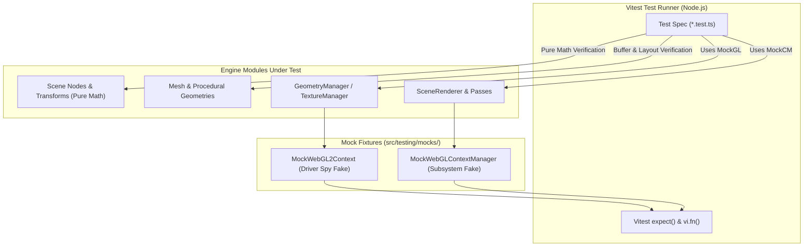

# Unit Testing Subsystem & Mocking Architecture Design

## 1. Overview & Objectives

### Purpose
This document specifies the architectural design for the unit testing framework and mock isolation subsystems. It establishes how tests verify the 3D scene engine, mathematical foundations, procedural geometries, materials, and context management subsystems in deterministic headless environments.

### Core Architectural Goals
- **Deterministic Headless Execution:** Tests run cleanly in pure Node.js environments (CLI and CI) without native GPU drivers or display servers.
- **Microsecond Feedback Loops:** Vitest with native V8 execution allows incremental watch mode updates in under 50ms upon file modifications.
- **Interface-Decoupled Mocking:** Test doubles mirror the explicit contracts ([`IWebGLContextManager`](../webgl/core/context_manager_types.ts), [`IGeometryManager`](../webgl/geometry/geometry_manager_types.ts), [`ITextureManager`](../webgl/textures/texture_manager_types.ts), [`WebGL2RenderingContext`]) without hardcoded dependencies.
- **High-Fidelity Driver State Tracking:** Mocks record WebGL driver operations with `vi.fn()` spies to verify binding deduplication, uniform uploads, and deterministic resource release.

---

## 2. Mocking Subsystem Architecture

---

## 3. Mock Fixtures Specification

### A. Hardware Driver Mock: `MockWebGL2Context`
Defined in [`src/testing/mocks/mock_gl_context.ts`](mocks/mock_gl_context.ts) with types in [`src/testing/mocks/mock_gl_context_types.ts`](mocks/mock_gl_context_types.ts).

#### Capabilities
- Emulates essential WebGL2 constants (`gl.ARRAY_BUFFER`, `gl.ELEMENT_ARRAY_BUFFER`, `gl.STATIC_DRAW`, `gl.DYNAMIC_DRAW`, `gl.TRIANGLES`, `gl.FLOAT`, `gl.TEXTURE_2D`, `gl.TEXTURE_CUBE_MAP`, etc.).
- Stubs object handles (`createBuffer`, `createVertexArray`, `createTexture`, `createProgram`, `createShader`).
- Spies on state mutations (`bindBuffer`, `bindVertexArray`, `useProgram`, `bindTexture`, `viewport`).
- Tracks lifecycle calls (`deleteBuffer`, `deleteVertexArray`, `deleteTexture`, `deleteProgram`).
- Provides inspection helpers (`callsFor(methodName)`, `resetMocks()`, `isContextLost()`).

### B. High-Level Subsystem Mock: `MockWebGLContextManager`
Defined in [`src/testing/mocks/mock_context_manager.ts`](mocks/mock_context_manager.ts) with types in [`src/testing/mocks/mock_context_manager_types.ts`](mocks/mock_context_manager_types.ts).

#### Capabilities
- Conforms fully to [`IWebGLContextManager`](../webgl/core/context_manager_types.ts).
- Provides stubbed or spy-wrapped sub-managers: `geometries` ([`IGeometryManager`](../webgl/geometry/geometry_manager_types.ts)), `textures` ([`ITextureManager`](../webgl/textures/texture_manager_types.ts)), `shaders` ([`IShaderManager`](../webgl/shaders/shader_manager_types.ts)).
- Spies on `applyPipelineState()`, `createVertexBuffer()`, `releaseVertexBuffer()`, `setContext()`, and `getContext()`.

---

## 4. Test Authoring Procedures & Algorithms

### Algorithm: Verifying Hierarchical Transformations
1. Instantiate parent [`SceneNode`](../scene/core/scene_node.ts) $P$ and child [`SceneNode`](../scene/core/scene_node.ts) $C$.
2. Attach $C$ to $P$ via `P.addChild(C)`.
3. Set translation / rotation on $P$ and $C$.
4. Evaluate child world matrix $M_C = C.worldMatrix$.
5. Compute expected matrix $M_{\text{expected}} = M_P \times M_{\text{local}(C)}$.
6. Assert each matrix cell with `toBeCloseTo()` precision.
7. Mutate parent position.
8. Assert $C.isWorldDirty$ transitions to `true` (dirty propagation).
9. Query $C.worldMatrix$ and assert cache refreshes and $C.isWorldDirty$ resets to `false`.

### Algorithm: Verifying Hardware Deduplication
1. Create instance of [`GeometryManager`](../webgl/geometry/geometry_manager.ts) with a [`MockWebGL2Context`](mocks/mock_gl_context.ts).
2. Instantiate a [`MeshGeometry`](../scene/models/mesh_geometry.ts).
3. Call `geometryManager.bind(geometry)`.
4. Assert `mockGL.bindVertexArray` called once with allocated VAO handle.
5. Call `geometryManager.bind(geometry)` a second time with unchanged geometry version.
6. Assert `mockGL.bindVertexArray` call count did not increase (deduplicated).
7. Mutate geometry via `geometry.markDirty()` and call `bind()` again.
8. Assert buffer data upload was triggered.
9. Call `geometry.dispose()`.
10. Assert `mockGL.deleteBuffer` and `mockGL.deleteVertexArray` were called.
