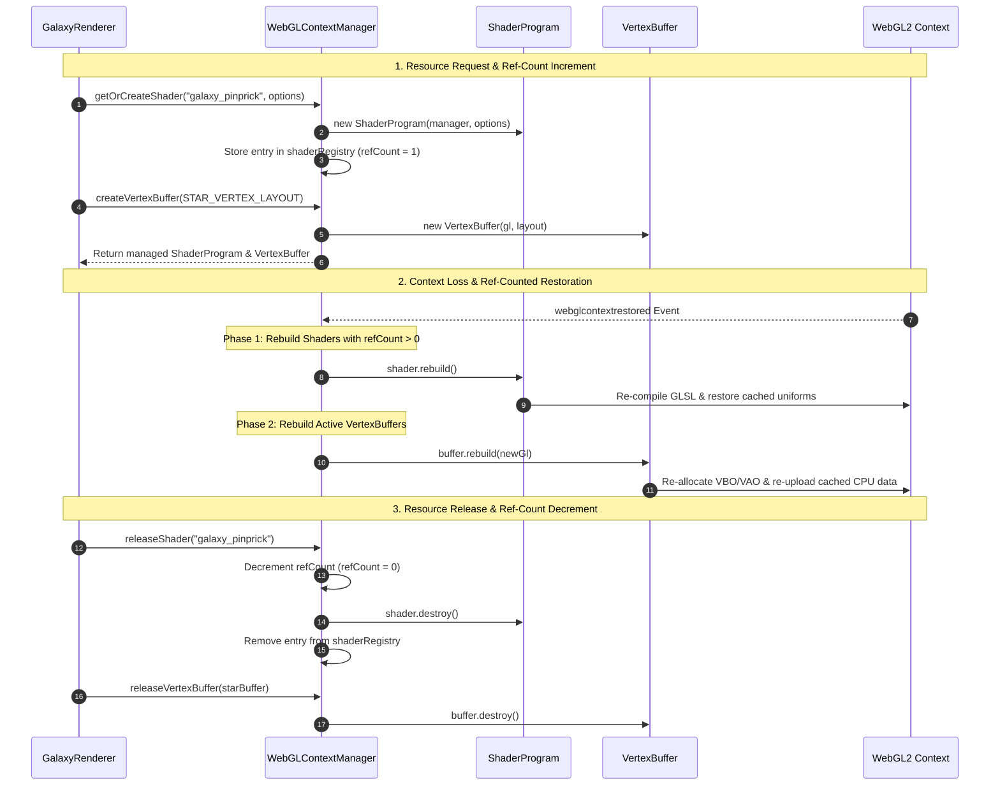

# WebGL Context Manager, Ref-Counted Shader Registry & Resource Lifecycle

## 1. Overview & Goals

### Overview
This document specifies a centralized WebGL GPU resource manager and ref-counted request/release lifecycle architecture. It introduces `WebGLContextManager` as the central factory for managing shared `ShaderProgram` instances and allocating `VertexBuffer` resources (VBOs and VAOs).

### Key Architectural Principles
- **Logical Need vs. GPU Build State:** The manager tracks the logical demand for a shader via reference counting (`refCount > 0`). This logical demand is independent of transient GPU build state (`WebGLProgram` handles), which is regenerated automatically upon context restoration.
- **Ref-Counted Shader Lifecycle:** Shader programs are requested via `contextManager.getOrCreateShader(key, options)` (incrementing `refCount`). When renderers unmount or dispose of shaders, they call `contextManager.releaseShader(key)` (decrementing `refCount`). When `refCount === 0`, GPU handles are freed and the shader is unregistered.
- **Request & Release Resource Factory:** Render passes request managed `VertexBuffer` instances (`contextManager.createVertexBuffer(layout)`) and release them (`contextManager.releaseVertexBuffer(buffer)`) upon disposal, preventing GPU memory leaks.
- **Automated 2-Phase Context Loss Recovery:** `WebGLContextManager` catches canvas context restoration events (`webglcontextrestored`) and automatically rebuilds GPU handles in exact dependency order:
  - **Phase 1 (Shaders with `refCount > 0`):** Re-compiles GLSL shaders, re-links WebGLPrograms, and re-queries uniform locations.
  - **Phase 2 (Buffers & VAOs):** Re-allocates GPU buffers, re-uploads cached CPU geometry data, and configures VAO pointers via `configureVAO()`.

---

## 2. Directory Structure

All generic WebGL infrastructure and lifecycle code reside in `src/webgl/`:

- **Shader & Manager Design Doc:** [`src/webgl/shader_program_design.md`](src/webgl/shader_program_design.md)
- **VAO Layout Design Doc:** [`src/webgl/shader_vao_layout_design.md`](src/webgl/shader_vao_layout_design.md)
- **Central Context Manager:** [`src/webgl/context_manager.ts`](src/webgl/context_manager.ts)
- **Managed Vertex Buffer:** [`src/webgl/vertex_buffer.ts`](src/webgl/vertex_buffer.ts)
- **Shader Program Utility:** [`src/webgl/shader_program.ts`](src/webgl/shader_program.ts)
- **VAO Layout Utility:** [`src/webgl/vertex_layout.ts`](src/webgl/vertex_layout.ts)
- **Domain Consumer (Galaxy Renderer):** [`src/galaxy_backdrop/galaxy_renderer.ts`](src/galaxy_backdrop/galaxy_renderer.ts)
- **Domain Consumer (Cloud Renderer):** [`src/galaxy_backdrop/galactic_cloud_renderer.ts`](src/galaxy_backdrop/galactic_cloud_renderer.ts)

---

## 3. Ref-Counted Shader & Buffer Lifecycle Flow



---

## 4. API Specifications

### `WebGLContextManager` ([`src/webgl/context_manager.ts`](src/webgl/context_manager.ts))

```typescript
export interface ShaderEntry {
    shader: ShaderProgram;
    refCount: number;
}

export class WebGLContextManager implements IWebGLContextManager {
    public setContext(gl: WebGL2RenderingContext): void;
    public getContext(): WebGL2RenderingContext | null;

    /** Retrieves or compiles a shared ShaderProgram (increments refCount) */
    public getOrCreateShader(key: string, options: ShaderProgramOptions): ShaderProgram;

    /** Decrements refCount; destroys GPU program and unregisters when refCount === 0 */
    public releaseShader(keyOrInstance: string | ShaderProgram): void;

    /** Factory method: Request a managed VertexBuffer instance */
    public createVertexBuffer(layout: VertexLayoutSpec): VertexBuffer;

    /** Release a VertexBuffer instance and free GPU handles */
    public releaseVertexBuffer(buffer: VertexBuffer): void;

    /** Catches webglcontextlost and clears stale GL references */
    public handleContextLost(): void;

    /** Catches webglcontextrestored and executes Phase 1 -> Phase 2 restoration */
    public handleContextRestored(newGl: WebGL2RenderingContext): void;
}
```
