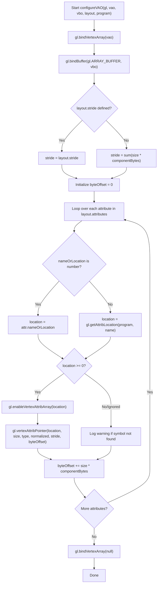

# Declarative Shader Attribute & VAO Layout Management

## 1. Overview & Goals

### Overview
WebGL rendering pipelines require binding GPU memory buffers (VBOs) to shader inputs via Vertex Array Objects (VAOs). Currently, VAOs are configured via imperative calls to `gl.enableVertexAttribArray` and `gl.vertexAttribPointer` with manual byte offset math and numeric location indices.

This design document outlines a declarative layout configuration system for WebGL2 shader attributes and VAOs. It shifts attribute declaration from manual imperative code to a type-safe schema specifying attribute names, component counts, types, offsets, and documentation descriptions.

### Goals
- **Declarative Schema:** Provide a single source of truth for vertex attribute layouts, combining GPU memory specifications with human-readable descriptions.
- **Automatic Stride & Offset Calculation:** Eliminate manual stride and byte offset calculations (`N * Float32Array.BYTES_PER_ELEMENT`).
- **Framework & Shader Agnostic:** Ensure the layout helper functions work across any WebGL2 rendering pass or background shader (e.g., galaxy renderer, starfield, particle systems).
- **Dual Binding Support:** Support both explicit GLSL 3.0 location layout qualifiers (`layout(location = N)`) and dynamic shader program symbol lookups (`gl.getAttribLocation`).
- **DRY & Maintainable VAO Registration:** Simplify VAO creation to iterating over a single configuration object.

---

## 2. Directory Structure

All generic WebGL utilities and infrastructure code are grouped under `src/webgl/`:

- Design Document: [`src/webgl/shader_vao_layout_design.md`](src/webgl/shader_vao_layout_design.md)
- Generic WebGL Layout Utilities: [`src/webgl/vertex_layout.ts`](src/webgl/vertex_layout.ts)
- Galaxy Star Buffer Schema: [`src/galaxy_backdrop/galaxy_layout.ts`](src/galaxy_backdrop/galaxy_layout.ts)
- Refactored Renderer: [`src/galaxy_backdrop/galaxy_renderer.ts`](src/galaxy_backdrop/galaxy_renderer.ts)

---

## 3. Types, Interfaces, & API Specification

### Attribute Definition (`AttributeSpec`)
Defines metadata and binary memory configuration for a single vertex attribute in a buffer layout.

```typescript
export interface AttributeSpec {
    /** Location index (for layout(location = N)) or shader attribute symbol name (e.g. "a_position") */
    nameOrLocation: number | string;

    /** Human-readable label and documentation for this vertex attribute field */
    description: string;

    /** Number of components per vertex attribute (1, 2, 3, or 4) */
    size: number;

    /** WebGL data type enum (e.g., gl.FLOAT, gl.UNSIGNED_BYTE). Defaults to gl.FLOAT */
    type?: number;

    /** Byte size per component (e.g., 4 for Float32Array). Defaults to Float32Array.BYTES_PER_ELEMENT */
    componentBytes?: number;

    /** Whether fixed-point data values should be normalized. Defaults to false */
    normalized?: boolean;
}
```

### Vertex Layout Specification (`VertexLayoutSpec`)
Defines the structure of a complete interleaved vertex buffer layout.

```typescript
export interface VertexLayoutSpec {
    /** Ordered array of attribute specifications comprising the interleaved vertex buffer */
    attributes: AttributeSpec[];

    /** Optional explicit total stride override in bytes. Computed automatically if omitted */
    stride?: number;
}
```

### Core API Functions

#### `computeLayoutStride(layout: VertexLayoutSpec): number`
Computes the total vertex stride (in bytes) by summing the byte sizes of all attributes unless an explicit `stride` is provided.

#### `configureVAO(gl: WebGL2RenderingContext, vao: WebGLVertexArrayObject, vbo: WebGLBuffer, layout: VertexLayoutSpec, program?: WebGLProgram): void`
Binds the target VAO and VBO, computes stride and cumulative offsets, iterates through each attribute spec, resolves attribute locations, and executes `gl.enableVertexAttribArray` and `gl.vertexAttribPointer`.

---

## 4. Algorithms & Execution Flow



### Procedure Details

1. **Validation & Context Binding:**
   - Bind target `vao` and `vbo` using WebGL2 context.
2. **Stride Calculation:**
   - Compute cumulative byte stride across attributes: $\text{stride} = \sum_{i} (\text{size}_i \times \text{bytes}_i)$.
3. **Location Resolution:**
   - If `nameOrLocation` is a number, use directly as a static layout location index.
   - If `nameOrLocation` is a string, query `gl.getAttribLocation(program, nameOrLocation)`.
4. **Pointer Configuration:**
   - Call `gl.enableVertexAttribArray(loc)`.
   - Call `gl.vertexAttribPointer(loc, size, type, normalized, stride, byteOffset)`.
5. **Offset Increment:**
   - Increment `byteOffset` by $(\text{size} \times \text{componentBytes})$.
6. **Cleanup:**
   - Unbind VAO (`gl.bindVertexArray(null)`).

---

## 5. Concrete Application: Galaxy Backdrop Renderer

### Star Buffer Schema Definition ([`src/galaxy_backdrop/galaxy_layout.ts`](src/galaxy_backdrop/galaxy_layout.ts))

```typescript
import { VertexLayoutSpec } from "../webgl/vertex_layout";

export const STAR_VERTEX_LAYOUT: VertexLayoutSpec = {
    attributes: [
        { nameOrLocation: 0, description: "Orbital Radius (a_radius)", size: 1 },
        { nameOrLocation: 1, description: "Base Angle / Initial Spiral Theta (a_baseAngle)", size: 1 },
        { nameOrLocation: 2, description: "Vertical Z Offset / Disk Height (a_zOffset)", size: 1 },
        { nameOrLocation: 3, description: "Base Star Size / Point Scale (a_size)", size: 1 },
        { nameOrLocation: 4, description: "Spectral Type / Temperature Index (a_spectralType)", size: 1 },
        { nameOrLocation: 5, description: "Micro-drift Scintillation Phase (a_driftPhase)", size: 1 },
    ],
};
```

### Refactored Initialization in `GalaxyRenderer`

```typescript
private initializeStarBuffers(gl: WebGL2RenderingContext): void {
    const starData = generateStarBuffer(this.params);

    this.vao = gl.createVertexArray();
    this.vbo = gl.createBuffer();

    gl.bindBuffer(gl.ARRAY_BUFFER, this.vbo);
    gl.bufferData(gl.ARRAY_BUFFER, starData, gl.STATIC_DRAW);

    if (this.vao && this.vbo) {
        configureVAO(gl, this.vao, this.vbo, STAR_VERTEX_LAYOUT);
    }
}
```

---

## 6. Migration Plan

1. **Create `src/webgl/` Directory & Utility Module:**
   Create [`src/webgl/vertex_layout.ts`](src/webgl/vertex_layout.ts) containing `AttributeSpec`, `VertexLayoutSpec`, and `configureVAO`.
2. **Create Galaxy Layout Configuration:**
   Define `STAR_VERTEX_LAYOUT` in [`src/galaxy_backdrop/galaxy_layout.ts`](src/galaxy_backdrop/galaxy_layout.ts).
3. **Refactor Renderer VAO Initialization:**
   Update `initializeStarBuffers()` in [`src/galaxy_backdrop/galaxy_renderer.ts`](src/galaxy_backdrop/galaxy_renderer.ts) to use `configureVAO`.
4. **Verification & Build Testing:**
   Run production build verification (`npm run build`) to ensure TypeScript type safety and bundler compatibility.
