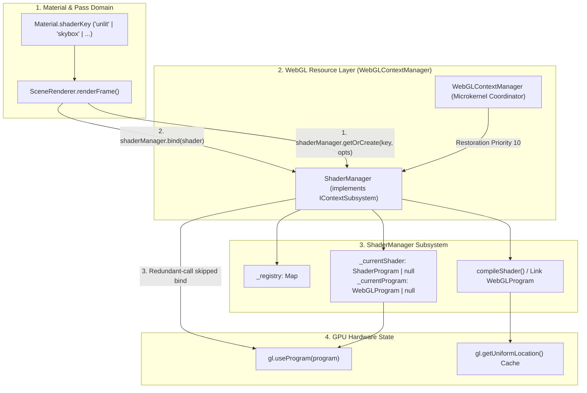

# WebGL Shader Manager Subsystem Architecture Design

## 1. Overview & Architectural Goals

### Purpose
In WebGL 2 applications, GPU shaders are microprograms compiled from GLSL source code, linked into `WebGLProgram` objects, and executed directly on GPU stream multiprocessors:
- **Vertex Shaders:** Transform 3D mesh vertices into 2D clip coordinates and pass per-vertex attributes and varying outputs to the rasterizer.
- **Fragment Shaders:** Compute the final pixel color, specular highlights, normal perturbed lighting, and texture lookups for rasterized fragments.
- **Hardware State Transitions:** Activating a shader program via `gl.useProgram()` alters the GPU pipeline configuration. Issuing redundant driver calls or compiling duplicate programs degrades frame rates and increases GPU VRAM consumption.

Together with [`GeometryManager`](geometry_manager_design.md) (geometries and VAOs/VBOs) and [`TextureManager`](texture_manager_design.md) (2D textures, cubemaps, and sampler units), the `ShaderManager` forms the resource triad defined in the [`Subsystem Microkernel Architecture`](subsystem_architecture_design.md).

---

### Core Architectural Goals
- **Architectural Symmetry & Subsystem Integration:** Implements [`IContextSubsystem`](subsystem_architecture_design.md) with `restorationPriority = 10` (Priority 1), ensuring shaders compile and uniforms initialize before textures and geometries restore.
- **Context-Scoped Singleton Caching (Zero Ref-Counting):** Compiling GLSL shaders and linking GPU programs is computationally expensive (causing 10–100ms CPU/GPU pipeline stalls). Shaders are context-scoped singletons cached permanently in `ShaderManager` for the life of the WebGL context. Shaders are never prematurely destroyed mid-session just because an active object count temporarily reaches zero.
- **Deterministic Program Disposal:** Explicit disposal is supported via `shaderManager.dispose(key)` or `shaderManager.destroy()`, immediately deleting native `WebGLProgram` and `WebGLShader` driver handles.
- **Zero-Stall Binding Deduplication:** Tracks the currently active `WebGLProgram` and `ShaderProgram` instances to skip redundant `gl.useProgram()` driver invocations during contiguous draw calls sharing the same shader.
- **Automated Phase 1 Context Restoration:** During WebGL context loss and restoration events (`webglcontextrestored`), the manager re-compiles all cached shaders and restores uniform locations before geometries are bound and draw calls are executed.
- **Compile-Time & Run-Time Type Safety:** Maintains strong generic typing for uniform dictionaries (`TUniforms`), ensuring type safety throughout scene rendering and material uniform updates.

---

## 2. Subsystem Architecture & Data Flow



---

## 3. Types & Interfaces Specification

All contracts reside in dedicated type definition files separate from concrete implementations.

### Shader Manager Types (`src/webgl/shader_manager_types.ts`)

```typescript
import type { ShaderProgram } from "./shader_program";
import type { ShaderProgramOptions } from "./shader_program_types";
import type { ShaderKey } from "./shader_types";
import type { IContextSubsystem, SubsystemDiagnostics } from "./subsystem_types";

/**
 * Public contract for the WebGL Shader Manager subsystem.
 * Manages context-scoped ShaderProgram instances, program binding deduplication,
 * and automated Phase 1 context restoration.
 */
export interface IShaderManager extends IContextSubsystem {
    /** The currently active ShaderProgram instance, if any */
    readonly activeShader: ShaderProgram<never> | null;

    /** The currently active raw WebGLProgram handle, if any */
    readonly activeProgram: WebGLProgram | null;

    /** Total number of unique shader programs registered in memory */
    readonly shaderCount: number;

    /**
     * Factory & Registry: Retrieves an existing cached ShaderProgram or compiles and caches a new one.
     * Hooks shader.onDispose() to automatically prune the shader from the registry upon disposal.
     */
    getOrCreate<TUniforms extends object = Record<string, unknown>>(
        key: ShaderKey,
        options: ShaderProgramOptions
    ): ShaderProgram<TUniforms>;

    /**
     * Registry Query: Retrieves an existing compiled ShaderProgram if registered.
     */
    get<TUniforms extends object = Record<string, unknown>>(
        key: ShaderKey
    ): ShaderProgram<TUniforms> | null;

    /**
     * Checks if a shader with the given key is currently registered.
     */
    has(key: ShaderKey): boolean;

    /**
     * Binds the specified ShaderProgram to the WebGL context with redundant-call skipping.
     */
    bind<TUniforms extends object = never>(shader: ShaderProgram<TUniforms> | null): void;

    /**
     * Low-level bind for a raw WebGLProgram with redundant-call skipping.
     */
    bindProgram(program: WebGLProgram | null): void;

    /**
     * Unbinds the currently active shader program.
     */
    unbind(): void;

    /**
     * Disposes all registered shader programs and clears internal caches.
     */
    destroy(): void;

    /**
     * Telemetry query returning active shader count and binding state.
     */
    getDiagnostics(): SubsystemDiagnostics;
}
```

---

## 4. Key Procedures & Algorithms

### 1. Acquisition & Compilation (`getOrCreate`)
1. **Cache Lookup:** Query `_registry` with `key`.
2. **Hit:** If an existing `ShaderProgram` is found, return it immediately.
3. **Miss:**
   - Verify that an active WebGL2 context is available via the parent context manager. If absent, throw a descriptive initialization error.
   - Instantiate `new ShaderProgram(contextManager, options)`.
   - Attach disposal subscriber:
     - `shader.onDispose(() => { if (this._currentShader === shader) this.unbind(); this._registry.delete(key); });`
   - Store in `_registry.set(key, shader)`.
   - Return newly compiled `shader`.

### 2. Deterministic Single-Disposal Pattern
- Callers and owners invoke `shader.dispose()` directly.
- The `ShaderProgram` frees its own `WebGLProgram` GPU handle (`gl.deleteProgram`) and invokes `onDispose` listeners.
- `ShaderManager`'s listener fires, unbinding the shader if active and deleting it from `_registry`.
- Subsystem managers do not provide individual `dispose(shader)` methods.

### 3. Redundant Binding Deduplication (`bind` & `bindProgram`)
1. **Object Check:** Compare `_currentShader === shader`. If identical, exit immediately (zero driver calls).
2. **Handle Check:** Compare `_currentProgram === program`.
3. **Driver Call:**
   - If changed, invoke `gl.useProgram(program)`.
   - Update `_currentProgram = program`.
4. **State Record:** Update `_currentShader = shader`.

### 4. Phase 1 Context Loss & Restoration
1. **`onContextLost()`:**
   - Set `_currentProgram = null` and `_currentShader = null`.
   - For all cached shaders, invoke `shader.onContextLost()`, marking handles null while preserving sources and uniforms.
2. **`onContextRestored(newGl)`:**
   - Reset tracked binding state (`_currentProgram = null`, `_currentShader = null`).
   - Iterate through `_registry.values()`: invoke `shader.onContextRestored(newGl)` for each cached shader program.
   - All shaders and their uniform location caches are now fully restored before textures (Priority 20) or geometries (Priority 30) restore.

---

## 5. Architectural Benefits

- **Zero Ref-Counting Overhead:** No artificial reference counters or risk of premature shader destruction mid-render loop.
- **Context-Scoped Efficiency:** Cost of GLSL compilation is paid exactly once per shader key for the entire session.
- **Subsystem Parity:** Implements [`IContextSubsystem`](subsystem_architecture_design.md), allowing [`WebGLContextManager`](context_manager.ts) to manage context loss and restoration generically.
