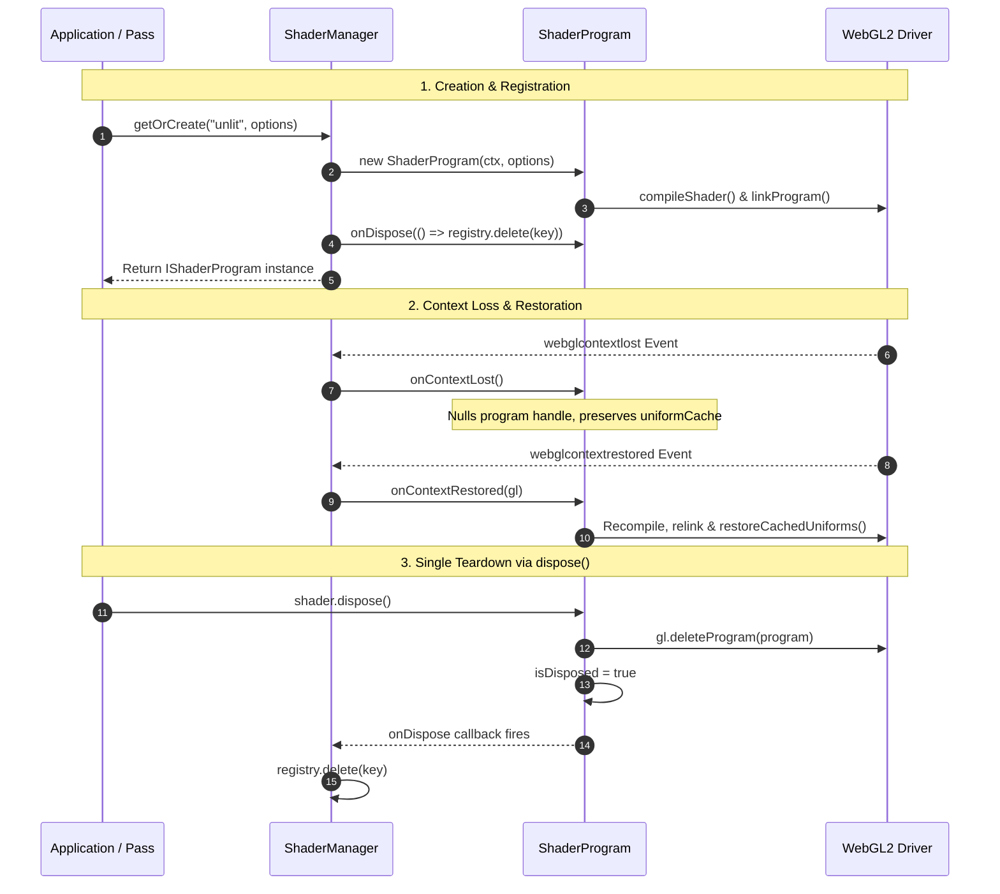

# WebGL Shader Program Architecture & Lifecycle Design

## 1. Overview & Goals

### Overview
This document specifies the architecture, public interface, and lifecycle contracts for [`ShaderProgram`](shader_program.ts). As part of the unified WebGL resource model documented in [WebGL Resource Lifecycle Design](../core/webgl_resource_lifecycle_design.md), `ShaderProgram` encapsulates GLSL compilation, program linking, uniform location reflection, redundant upload elimination, and automated context restoration.

### Key Architectural Principles
- **Unified `IWebGLResource` Lifecycle:** `ShaderProgram` implements `IWebGLResource` (extending `IDisposable`). It provides dedicated lifecycle methods: `onContextLost()`, `onContextRestored(gl)`, and `dispose()`.
- **Single Public Teardown Method (`dispose()`):** Calling `shader.dispose()` deletes the `WebGLProgram` handle (`gl.deleteProgram`), unbinds from context if active, marks `isDisposed = true`, and fires `onDispose` listeners to automatically evict the shader from `ShaderManager`'s registry.
- **Automated Context Recovery:** On `onContextLost()`, GPU program handles and location caches are marked invalidated without calling driver deletion. On `onContextRestored(gl)`, `ShaderProgram` recompiles GLSL sources, relinks the program, re-queries uniform locations, and re-uploads cached uniform memory.
- **Smart Redundant Upload Elimination:** Redundant uniform uploads are eliminated through client-side value caching (`uniformCache`). Consecutive frames uploading identical matrix or vector values incur zero driver overhead.

---

## 2. Types & Interface Specification

### `IShaderProgram` Contract (`src/webgl/shaders/shader_program_types.ts`)

```typescript
import type { IWebGLResource } from "../core/resource_types";
import type { ResourceFactoryToken } from "../core/resource_token";

export interface IShaderProgram<TUniforms extends object = Record<string, unknown>>
    extends IWebGLResource {
    readonly label: string;
    readonly vertSource: string;
    readonly fragSource: string;
    readonly isValid: boolean;

    /** Gets the underlying WebGLProgram GPU handle, or null if context lost or disposed */
    getProgram(): WebGLProgram | null;

    /** Batch uploads a typed dictionary of uniforms with binding validation */
    setUniforms(uniforms: Partial<TUniforms>): void;

    /** Uniform upload setters with caching */
    setFloat(name: string, value: number): void;
    setInt(name: string, value: number): void;
    setVec2(name: string, x: number, y: number): void;
    setVec3(name: string, x: number, y: number, z: number): void;
    setVec4(name: string, x: number, y: number, z: number, w: number): void;
    setMat3(name: string, data: Float32Array): void;
    setMat4(name: string, data: Float32Array): void;

    /** Queries cached uniform location */
    getUniformLocation(name: string): WebGLUniformLocation | null;

    /** WebGL context lost lifecycle hook */
    onContextLost(): void;

    /** WebGL context restored lifecycle hook */
    onContextRestored(gl: WebGL2RenderingContext): void;

    /** Deterministic disposal: frees GPU program handle and notifies listeners */
    dispose(): void;
}
```

---

## 3. Shader Program Lifecycle Flow



---

## 4. Key Procedures

### 1. Program Build & Uniform Reflection
1. Compiles vertex and fragment shaders using `compileShader()`.
2. Creates and links the `WebGLProgram`.
3. Verifies `gl.LINK_STATUS`. Upon success, detaches and deletes individual shader objects to conserve driver memory.
4. Auto-reflects active uniforms (`gl.getActiveUniform`), populates `uniformLocations` map, and assigns sampler texture unit uniforms.

### 2. Context Restoration (`onContextRestored`)
1. Executes `onContextLost()` to safely wipe stale handles.
2. Re-executes the build procedure against the new WebGL context.
3. Iterates over `uniformCache` and re-uploads all cached uniforms to the new GPU program handle via `restoreCachedUniforms()`.

### 3. Deterministic Teardown (`dispose`)
1. If `isDisposed` is true, returns immediately.
2. Marks `isDisposed = true`.
3. If active context is valid, invokes `gl.deleteProgram(this.program)` and unbinds from context if currently active.
4. Clears `uniformLocations` map.
5. Invokes all registered `onDispose` listeners and clears the listener array.
